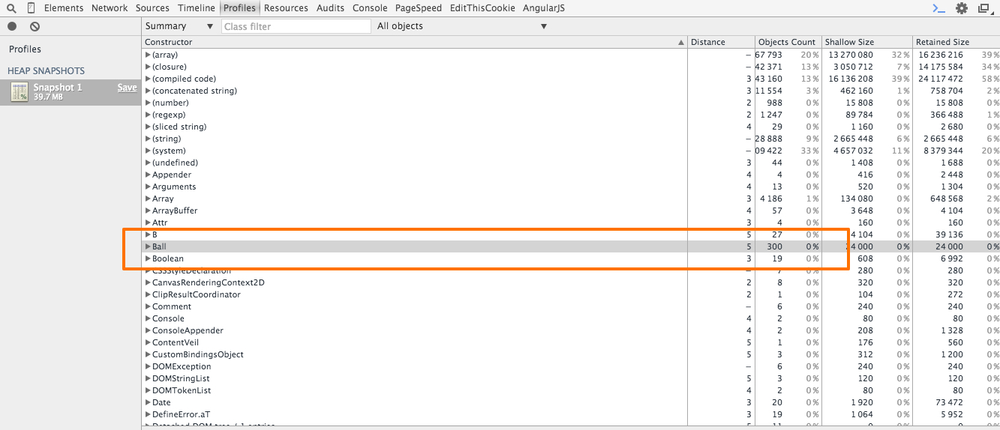
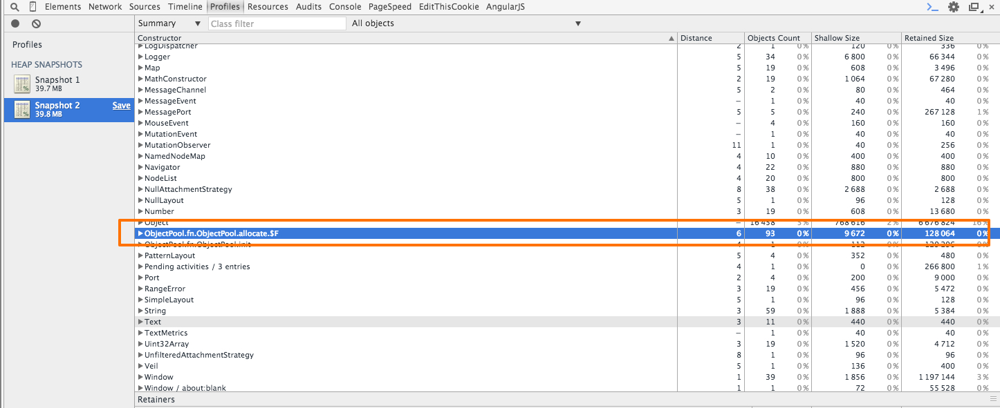

## 1. 정의

- 생성된 **객체**들을 별도의 **Pool** 안에 저장 후 재사용 하는 방법으로, 불필요한 객체 **생성** 및 **반환**(**GC**에 의한)을 최소화하는 <u>**디자인 패턴**</u>중 하나 이다.

	- **객체**  재사용을 위해, 생성된 **객체**를 **Pool** 안에 저장시켜 놓는다.

	- 새로운 **객체**가 필요할때는, <u>무조건 새로 생성</u>하는것이 아니라, **Pool** 안에 반환된 **객체**가 존재한다면, <u>그 중 하나를 재사용 한다.</u>

		- *객체 재사용으로 Heap 메모리 사용을 최소화한다.*

	- 사용(객체)이 끝난 후에는 <u>다시 **Pool** 안에 반환시킨다.</u>

## 2. 특징

- 정해진 **범위**내에서 개발자가 직접 <u>**Heap 메모리**를 관리(객체 생성 및 반환)</u>할 수 있다.

	- <u>**객체 생성 비용**</u>을 줄일 수 있다.(Heap 메모리 사용을 줄일 수 있다)

		- *당연한 말이겠지만, 생성되는 객체 크기 및 그 수에 따라, <u>더 많은 비용을 줄일 수도 있다.</u>*

	- **GC** 를 통해 일어나는, <u>메모리 반환(반환 시 일어나는 일련의 작업들)) **비용**을 줄일 수 있다.</u>

		- 보통 이 과정(메모리 반환 과정)을 처리하는 동안에는, **프로그램 실행** 이 중단된다.

		- 또한, 이 과정은 <u>프로그램 실행 중 임의의 시간에, 임의의 시간동안 언제라도 일어날 수 있다.</u>

		- 개발자는 이 **과정**을 <u>제어할 수 없다.</u>

		[Static Memory Javascript with Object Pools](http://www.html5rocks.com/ko/tutorials/speed/static-mem-pools/)

- 재사용되는 **객체**는 <u>모두 **동일한 타입**을 갖는다.</u>

## 3. JS 로 동적 ObjetPool 구현해보기

<iframe height='540' scrolling='no' src='http://codepen.io/yanione/embed/jPdzWB/?height=540&theme-id=0&default-tab=result' frameborder='no' allowtransparency='true' allowfullscreen='true' style='width: 100%;'>See the Pen <a href='http://codepen.io/yanione/pen/jPdzWB/'>jPdzWB</a> by mohwa (<a href='http://codepen.io/yanione'>@yanione</a>) on <a href='http://codepen.io'>CodePen</a>.
</iframe>

- 일반적인 동적 **Objet Pool** 기능을 만드는 방법은 위 코드와 같이 크게 어렵지 않다.(물론 지원하는 기능의 범위에 따라, 구현 수준은 크게 달라질 수 있다)

## 4. ObjectPool 적용 테스트

- Click 버튼을 10번 누른 후 **Profiles(in Chrome Tool) 패널**을 통해, **Heap Memory** 를 체크하면 적용 **유/무**에 따른 결과를 얻을 수 있다.

	- **Object Pool** 적용 전

		- Ball 생성자 함수를 통해 객체를 **300**개 할당했다.

			- 30 * 10 = 300(무조건 새로운 객체를 Heap 메모리에 할당했다)

		

	- **Object Pool** 적용 후

		- $F 생성자 함수를 통해 **93**개의 객체를 할당했다.

			- $F: **Object Pool** 라이브러리상에서 만든 생성자 함수.

			- 적용 후에는 총 **93**개의 객체를 할당했으며, **207**개의 객체를 재사용하였다.

		

## 5. 정리하며

- 즉 지나친 객체 생성 및 반환을 **최소화** 하는것이, **어플리케이션**상에 메모리 변동을 줄이는 방법이며, 이로인해 사용자 경험까지 최적화할 수 있다.

- 일반적인 **웹**상에서는 적용할 일이 거의 없어보이지만, **게임 어플리케이션**이라면, 적용 범위가 꽤 많을 듯 하다.

## 6. 참고 URL

- [액션스크립트의 객체 재사용을 위한 오브젝트 풀(Object Pool)](http://ufx.kr/blog/591)

- [Static Memory Javascript with Object Pools](http://www.html5rocks.com/ko/tutorials/speed/static-mem-pools/)

- [Object Pools](http://beej.us/blog/data/object-pool/)

