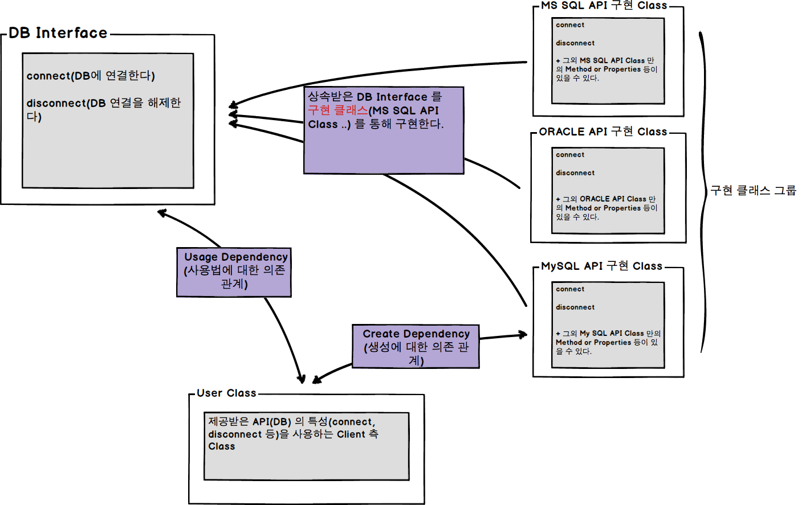

## 1. 정의

- 가장 큰 범위의 [인터페이스](https://ko.wikipedia.org/wiki/%EC%9D%B8%ED%84%B0%ED%8E%98%EC%9D%B4%EC%8A%A4) `정의`는 사물 간 또는 사물과 인간 간([User Interface](https://ko.wikipedia.org/wiki/%EC%82%AC%EC%9A%A9%EC%9E%90_%EC%9D%B8%ED%84%B0%ED%8E%98%EC%9D%B4%EC%8A%A4))의 의사소통을 위한 중간 매개체다. 즉 서로간의 의사소통을 위해 정해진 약속이 존재하며, 이를 `표준 규격` 이라 말할 수 있는것이다.

## 2. 의미

- **인터페이스**(`DB Interface`):

	- **구현 클래스**가 공통적으로 가져야할 필수 특성(connect, disconnect 등)들을 **선언**함으로써, 해당 구현 클래스들에게 **사용자**(`User Class`)와의 **의사 소통** 방침(표준 규격)을 알리는데 목적이 있다.

		- [x] *인터페이스 내부에 선언된 모든 특성은 구현 클래스를 통해 반드시 구현되어야 한다.*

- **구현 클래스**(`MSSQL, ORACLE API Class 등`):

	- 사용자(`User Class`)와의 의사소통을 위해 인터페이스 내부에 선언된 모든 특성들을 충실히 구현한다.

		- *이때 `사용자` 입장에서는 특정 구현 클래스 `명세` 없이도, 인터페이스 명세에 따라 제공받은 모든 API 를 사용할 수 있다는 장점이 존재한다.*

			- [x] *정확히 말하자면, 특정 API 의 모든 기능이 아닌 인터페이스를 구현한 기능에 한정된다.*

## 3. 상황에 따른 의미

- 만약 운영중인 어플리케이션의 DB 플랫폼이 **MSSQL** 에서 **PostgreSQL** 로 변경된다고 가정해보자.(오랜 기간 운영중인 어플리케이션의 경우 이런저런 이유로 이와 같은 상황이 충분히 올 수 있다)

	이때 위 다이어그과 같은 `인터페이스 설계`가 되어있는 상태라면, **PostgreSQL** 규격에 따라, 구현 클래스만 작성하면 최소 비용으로 기능을 확장할 수 있을 것이다.

	- *또 `사용자 입장`에서보면, 인터페이스를 통해 구현된, 공통적인 기능 만큼은 기존 코드를 재사용할 수 있다는 큰 장점까지 갖게 되는 것이다.(어플리케이션 유지보수 비용 최소화)*

## 4. JS 로 인터페이스 구현해보기

<iframe width="100%" height="1000" src="http://jsfiddle.net/mohwa/jzu5r06e/3/embedded/js" allowfullscreen="allowfullscreen" frameborder="0"></iframe>

인터페이스 `구현`은 아래 **C# 인터페이스 가이드**에 맞춰 구현되었으며, JS 코드에 대한 자세한 설명은 따로 하지 않겠다.(만약 JS 에 대해 어느정도 알고 있는 상황이라면, 코드를 분석해보길 권장한다)

- 아래는 구현에 대한 간략한 설명이다.

	- 인터페이스 선언을 위한 인터페이스 함수 객체를 구현한다.

		- 인터페이스 [이벤트] 선언을 위해 **Observer** 기능을 구현한다.

		- [C# 이벤트 선언](https://msdn.microsoft.com/ko-kr/library/awbftdfh.aspx)

	- 인터페이스를 상속받은 **구현 클래스**를 검증(상속받은 인터페이스를 모두 구현했는지에 대한 검증)하는 함수 객체(Interface.ensureImplement)를 구현한다.

	- 위 다이어그램과 같이 **인터페이스** 및 각 **클래스**(구현 클래스)들을 구현한다.

- [C# 인터페이스](https://msdn.microsoft.com/ko-kr/library/ms173156.aspx)(인터페이스 `정의`는 각 언어마다 조금씩 차이를 보인다(모든 언어에 동일하게 구현되어있지 않다))

## 5. 정리하며

- **인터페이스**는 개발 중인 어플케이션 규모 및 설계에 따라 적용 범위가 얼마든지 달라질 수 있다.(또는 사용이 불필요할 수 도 있다(간혹 팀내에서의 **관행**적인 적용이 있다는 말을 들은적이 있는데 이건 정말 아닌듯 하다;;;))

	- *너무 당연한 말일 수 도 있지만, 인터페이스와 같은 모든 디자인 패턴은 적재 적소에 활용해야만 득이되는 것이다.*

- 위에서 언급한 내용과 다른 **적용 사례**에 대해(*인터페이스를 구현하는 상황이 또 모가 있을까?) 한번쯤 심도있게 생각해보길 바란다*

## 6. 참고 URL

- [DI란?](http://woonohyo.tistory.com/22)

- [인터페이스 사용이유](http://okky.kr/article/161248)

- [인터페이스란](http://masamune.tistory.com/16)

- [C# 인터페이스 인덱서](https://msdn.microsoft.com/ko-kr/library/tkyhsw31.aspx)

- [C# 인터페이스 속성](https://msdn.microsoft.com/ko-kr/library/64syzecx.aspx)

- [C# 인터페이스 이벤트](https://msdn.microsoft.com/ko-kr/library/ak9w5846.aspx)

