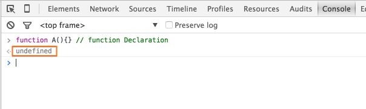
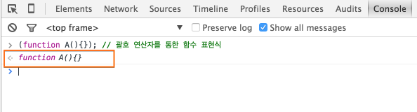
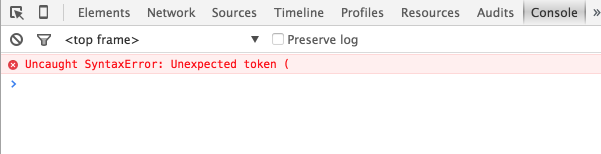
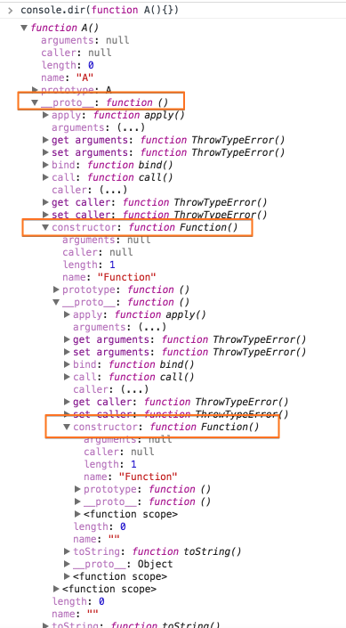
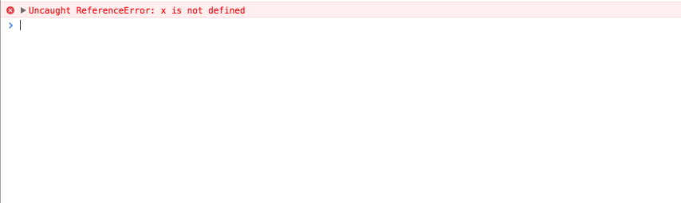

꽤 오래전에 구입했었던, [JavaScript 성능 최적화](http://www.hanbit.co.kr/book/look.html?isbn=978-89-7914-855-8)라는 책을 다시 한번 읽어보며, 책 내용 중 개인적으로 중요하다고 느꼈던 부분과, 당시 [모호](http://krdic.naver.com/detail.nhn?docid=13706300)했었던 부분들을, 이 포스트를 통해, 다시한번 정리해나갈 생각이다. 아마 이 책을 소지하고계신 분이라면, 책 내용을 이해하는데, 조금은 도움이될 듯 합니다.

## 글에 대해

- 자주 언급되는 특정 <span style="color:#c11f1f">[JS 용어](http://mohwa.github.io/blog/search/?category=javascript)</span>(**VO**, **AO**, **Scope Chain** 등)에 대해서는 따로 설명하지 않으며, **링크**된 **블로그 글**을 통해 찾아볼 수 있을것이다.

## 데이터 접근

- <h3>원글: <em><strong>리터널 값</strong>이란? 단순히 자신을 나타낼 뿐이며, 특정 장소에 저장되지 않는 <strong>모든 값</strong>입니다. JS 에서는 문자열, 숫자, 불리언, 객체, 배열, <span style="color:#c11f1f">함수</span>, 정규 표현식, 특별한 값인 null 과 undefined 가 <strong>리터널</strong>입니다.</em></h3>

    - 여기서 말하는 <span style="color:#c11f1f">함수</span>는 **함수 선언식**이 아닌, <span style="color:#c11f1f">함수 표현식</span>만을 **의미**한다.

      - **함수 선언식**은 단순히 <u>함수를 정의하는 **문장**으로 해석</u>되며, 실행 코드 처리 시 <span style="color:#c11f1f">값</span>으로 평가되지않는다.

          - 함수 선언식

            

      - <span style="color:#c11f1f">함수 표현식</span>은 <span style="color:#c11f1f">값</span>으로 평가된다.

          - 함수 표현식

            

      - <span style="color:#c11f1f">함수 선언식</span>은 **함수 표현식**과 달리, 반드시 **함수 이름**을 가져야한다.(즉 **익명 함수**가 허용되지 않는다)

          - *The main difference between a function expression and a function statement is the function name, which can be omitted in function expressions to create anonymous functions.*

          - 함수 선언식

            ```javascript

            // global execution context

            // 함수 선언식은 반드시 함수 이름을 가져야한다.
            function (){

                // function execution context
            }
            ````

            

          - 함수 표현식

            ```javascript

            // global execution context

            // 익명 함수 표현식(AFE)
            var fn1 = function(){
                // function execution context
            };

            // 기명 함수 표현식(NFE)
            var fn2 = function A(){
                // function execution context

                console.log(A); // function object
            };


            // 괄호 연산자를 통한 익명 함수 표현식
            (function (){
                // function execution context
            });


            // 괄호 연산자를 통한 기명 함수 표현식
            (function B(){
                // function execution context
            });


            // 괄호 연산자를 통한 즉시 실행 함수(익명/기명)
            (function() {
                // function execution context
                console.log('immediately invoked function'); // immediately invoked function
            })();

            (function C(){
                // function execution context
                console.log(C); // function object
                console.log('immediately invoked function'); // immediately invoked function
            })();


            // 그밖의 함수 표현식들

            // 하지만 아래 표현식들은 의도된 함수 반환 값을 가질 수 없다는 단점이 존재한다.
            // 즉 아래 함수 표현식들은 실제 코드상에서 사용하지 않는 편이 좋다.
            console.log(0,function(){ return 1; }()); // 0 1

            console.log(!function(){ return 1; }()); // false
            console.log(!function(){ return false; }()); // true

            console.log(~function(){ return 1; }()); // -2
            console.log(-function(){ return -100; }()); // 100
            console.log(+function(){ return -100; }()); // -100

            // 위에서 언급했던것처럼 함수 표현식은 값으로 평가된다.
            // 즉 아래, 함수 표현식들은 값으로 평가되어 new 연산자를 통해, 새로운 객체를 생성하게된다.
            new function A(){
                console.dir(this); // function object
            }; // === new A;

            new function A(){
                console.dir(this); // function object
            }(); // === new A();
            ````

  - [Function in JS](http://mohwa.github.io/blog/javascript/2015/10/15/function-inJS/)

  - [Variable Object in JS](http://mohwa.github.io/blog/javascript/2015/10/14/vo-inJS/)

  - [문법과 타입](https://developer.mozilla.org/ko/docs/Web/JavaScript/Guide/Values,_variables,_and_literals#Literals)

  - [JavaScript Function Literals](http://www.tutorialspoint.com/javascript/javascript_function_literals.htm)

  - [3.4. Functions](http://docstore.mik.ua/orelly/webprog/jscript/ch03_04.htm)

  - [Function Declarations(함수선언) vs Function Expressions(함수표현)](http://insanehong.kr/post/javascript-function/)

  - [Function Declarations vs. Function Expressions](https://javascriptweblog.wordpress.com/2010/07/06/function-declarations-vs-function-expressions/)

  - [function expression](https://developer.mozilla.org/en-US/docs/Web/JavaScript/Reference/Operators/function)

  - [What is the difference between a function expression vs declaration in JavaScript?](http://stackoverflow.com/questions/1013385/what-is-the-difference-between-a-function-expression-vs-declaration-in-javascrip)

  - [IIFE](http://benalman.com/news/2010/11/immediately-invoked-function-expression/)

- <h3>원글: <em><strong>변수</strong>는 데이터를 저장할 목적으로, <u><span style="color:#c11f1f">var</span> 키워드를 써서 만든</u>, 개발자가 정의한 위치입니다.</em></h3>

  - <strike><em>"개발자가 정의한 위치"</em> 라는 **표현**은 왜 썼는지 이해가 되지 않는다.</strike><p />

  - 글 공개 후, 지인을 통해 <span style="color:#c11f1f">"개발자가 정의한 위치"</span> 라는 표현은 **스코프**를 말하는 것이 아닐까?" 라는 말을 들었다.<p />

  - 내 생각도 그것과 크게 다르지 않으나, 구지 **Scope** 라는 큰 범위의 의미를 **변수**를 설명하기 위한 이 **한 문장**에 꼭 넣어야 했을까? 라는 생각이 들기도 한다...<p />

  - **변수**는 오직 <span style="color:#c11f1f">var</span> 키워드를 통해서만 선언된다.

      ```javascript

      // global Execution Context

      // var 키워드를 통한(변수 선언식) x 변수는 execution context 진입 시 VO 의 속성으로 추가되며, undefined 로 초기화된다.
      console.log(x); // undefined

      try{
          // var 키워드가 생략된 y 속성은 execution context 진입 시 VO 의 속성으로 추가되지않는다.
          console.log(y);
      }
      catch (ex){
          console.log(ex.message); // y is not defined
      }

      // var 키워드를 통한 x 변수
      var x = 1;

      // var 키워드가 생략된 y 속성
      y = 2;

      // var 키워드를 통한 x 변수는 non-configurable(DontDelete) 로 정의된다.
      console.log(Object.getOwnPropertyDescriptor(this, 'x')); // Object {value: 1, writable: true, enumerable: true, configurable: false}

      // var 키워드가 생략된 y 속성은 configurable 로 정의된다.
      console.log(Object.getOwnPropertyDescriptor(this, 'y')); // Object {value: 2, writable: true, enumerable: true, configurable: true}


      // 실행 코드 처리 후 1 이 할당된다.
      console.log(x); // 1 === this.x

      // 실행 코드 처리 후 2 가 할당된다.
      console.log(y); // 2 === this.y

      // non-configurable(DontDelete) 속성으로 정의된 x 변수는 delete 연산자를 통해 삭제되지 않는다.
      delete this.x;

      // configurable 속성으로 정의된 y 속성은 delete 연산자를 통해 삭제된다.
      delete this.y;

      // delete 연산자를 통해 삭제되지 않았다.
      console.log(x); // 1 === this.x

      try{
          console.log(y);
      }
      catch (ex){
          // delete 연산자를 통해 삭제되었다.
          console.log(ex.message); // y is not defined
      }
      ```

  - [Variable in JS](http://mohwa.github.io/blog/javascript/2015/10/14/variable-inJS/)

## **Scope Chain** 과 **식별자 해석**

- <h3>원글: <em><u>JS 함수는 <strong>객체</strong>이고, 엄밀히 말해 <span style="color:#c11f1f">Function</span> 의 인스턴스 입니다.</u> 함수 객체는 다른 모든 객체와 마찬가지로 속성이 있는데, 이 속성은 프로그램에서 접근할 수 있는 속성과 JS 엔진에서 사용되며, 코드(개발자가 직접)에서 접근할 수 없는 <strong>내부 속성</strong>으로 나뉩니다. 이러한 <strong>내부 속성</strong> 중 하나가 ECMA-262 세 번째 판에서 정의한 [[Scope]] 속성 입니다.</em></h3>

  - JS 함수는 <span style="color:#c11f1f">Function</span> **생성자 함수 객체**로 만든 또 다른 **함수 객체** 이다.

      - 이전에 작성했었던, [객체 지향 언어의 두 가지 줄기](http://mohwa.github.io/blog/javascript/2015/10/16/prototype/)라는 글에서, **inifnite regress problem of classes** 라는 말을 언급한적이있었다.

          ```javascript

          프로토타입 기반 OO는 객체를 직접 이용하는데 비해, 클래스 기반의 OO는 클래스라는 틀을 이용해서 객체를 생성하죠.

          자연스럽게 나오는 질문은 "그럼 클래스는 대체 어디서 나온 것인가?"라는 거죠.

          대표적 클래스 기반 OO인 Java는 클래스도 객체로 봅니다. 그런데 클래스가 객체면 클래스를 찍어낸 클래스가 있어야 합니다. 클래스를 찍어낸 클래스도 객체이므로, 클래스를 찍어낸 클래스를 만드는 클래스도 있어야 합니다.

          이렇게 무한히 반복 되기 때문에 "inifnite regress problem of classes"라고 불리는 것이죠.

          Java는 이 문제를 java.lang.Class가 모든 클래스의 틀이라고 이야기하면서, 은근 슬쩍 넘어갔지만 여기에 숨은 논리적인 문제를 확실히 못풀고 "태초에 Class가 있었다"라는 해법이 나와버리는거죠.

          다른 접근 방법을 취한 언어가 있는지 모르겠지만, 대부분의 클래스 기반 언어는 클래스는 second-order citizen으로 특별히 취급해서 찍어낼 수 있는 틀은 원래 있었다라고 얘기하게 되는거죠.

          그 대상이 클래스라는 거만 제외하면 접근 방법은 프로토타입 방식과 크게 다르지 않은 거고요.
          ```

      - 이 말은 JS **함수 객체**에서도 동일하게 적용될 수 있다. 즉 **함수**를 생성하는 <span style="color:#c11f1f">Function</span> **생성자 함수 객체**를 생성하기 위해서는, 또 다른 <span style="color:#c11f1f">Function</span> **생성자 함수 객체**가 무한히 반복되기 때문이다.

         

  - [Variable Object in JS](http://mohwa.github.io/blog/javascript/2015/10/14/vo-inJS/)

- <h3>원글: <em>함수가 만들어질 때(함수 생성 시), 함수가 생성된 스코프에서 접근할 수 있는, 데이터를 나타내는 객체(<span style="color:#c11f1f">VO</span>)와 함께 <strong>Scope Chain</strong>이 만들어집니다.</em></h3>

  - 원글과 달리, **Scope Chain** 은 <u><span style="color:#c11f1f">함수 생성 시점</span></u>이 아닌, <u><span style="color:#c11f1f">함수 호출 시점</span></u>에서 해당 Function Execution Context 내부에 **생성**된다.

  - <span style="color:#c11f1f">함수 생성 시에는</span>, 해당 Function Execution Context 상위에 있는, **모든 부모 계층**의 <span style="color:#c11f1f">VO</span> 들을 [[Scope]] 속성으로 **할당**시킨다.

      ```javascript
      // global Execution Context
      var x = 1;

      function A(){
          // function Execution Context
          var y = 2;
      }
      ```

   - 생성된 **함수 객체** 내부

      ```javascript
        A: {
        [[Scope]]: [
          // [[Scope]] 속성에는 해당 function execution context 상위에 있는, 모든 부모 계층의 VO 가 할당된다.
          globalExecutionContext.VO: {
            x: 1,
            A: < reference to function >
          }
        ]
      }
      ```

- <h3>원글: <em>실행 문맥도 식별자 해석에 쓸 자기만의 <strong>Scope Chain</strong> 이 있습니다. 실행 문맥이 만들어질 때 이 문맥의 <strong>Scope Chain</strong>은 실행 중인 함수의 [[Scope]] 속성에 있는 <strong>객체로 초기화</strong>됩니다. 이 과정이 끝나면 활성화 객체(<span style="color:#c11f1f">AO</span>)라고 부르는 새로운 객체가 실행 문맥에 생성됩니다. 활성화 객체(<span style="color:#c11f1f">AO</span>)는 이 실행에 대해 변수 객체(<span style="color:#c11f1f">VO</span>) 구실을 하며, 모든 지역 변수, 명명된 매개변수, arguments 집합, this 항목을 포함합니다.</em></h3>

- <h3><em>활성화 객체(<span style="color:#c11f1f">AO</span>)는 <strong>Scope Chain</strong> 의 앞에 자리 잡습니다. 실행 문맥이 파괴될 때, 활성화 객체(<span style="color:#c11f1f">AO</span>)도 같이 파괴됩니다.</em></h3>

  - <span style="color:#c11f1f">함수 호출 시</span>, 함수 [[Scope]] 속성과, Function Execution Context 내부 <span style="color:#c11f1f">AO</span>(VO) 를 포함하는, **Scope Chain** 이 생성된다.

      -  [<span style="color:#c11f1f">AO</span>(VO), [[Scope]]] = **Scope Chain**

      - <span style="color:#c11f1f">AO</span> 는 **Scope Chain** 의 가장 <span style="color:#c11f1f">앞</span>(ScopeChain[0])에 추가되며, **식별자 검색** 시 가장 먼저 검색된다.<p>

          

          ```javascript
          // global Execution Context
          var x = 1; // VO.x

          function A(){
              // function Execution Context
              var y = 2; // AO(VO).y
          }

          // A 함수객체를 호출한다.
          A();
          ```

       - <span style="color:#c11f1f">ECStack</span> 내부

          ```javascript
          var ECStack = [
            // A function execution context
            <A> functionExecutionContext: {
              AO(VO): {
                y: 2
              },
              Scope(Scope Chain): [
                // 함수 호출 시, 생성된 AO(VO) 는 Scope Chain 의 가장 앞에(ScopeChain[0]) 추가되며, 식별자 검색 시, 가장 먼저 검색된다.
                AO(VO): {
                  y: 2
                },
                // 함수 생성 시, [[Scope]] 속성에 추가되었던, globalExecutionContext 의 VO
                globalExecutionContext.VO: {
                  x: 1,
                  A: < reference to function >
                }
              ],
              this: global object
            },
            // global execution context
            globalExecutionContext: {
              VO: {
                x: 1,
                A: < reference to function >
              },
              Scope(Scope Chain): [
                // global execution context 내부 Scope Chain 에는 globalExecutionContext.VO 만 포함된다.
                globalExecutionContext.VO
              ],
              this: global object
            }
          ];
        ```

- <h3>원글: <em><span style="color:#c11f1f">식별자 검색</span>을 통해, 끝까지 찾지 못하면 <strong>변수</strong>가 선언되지 않은 것으로 간주합니다.</em></h3>

  - **런타임 오류**가 발생된다.

    ```javascript
    // global execution context

    function A(){

        // function execution context
        console.log(x);
    }

    A();
    ```

    


- <h3>원글: <em>함수 스코프 바깥에 있는 값을 한번 이상 사용할 거라면, 항상 지역 변수에 저장한다는 원칙을 가지는게 좋습니다. 만약 수십 개의 <strong>전역 변수</strong>에 반복해서 접근해야하는 큰 함수일경우, 성능이 비약적으로 좋아질것입니다.</em></h3>

  - 이 말은, <span style="color:#c11f1f">식별자 검색</span>이 **JS 엔진**에 의해, **최적화**되지않은 **상황**을 고려해야한다는 말이다.(즉 **APP** 이 오래된 브라우저(IE 7 ~ 8 등)를 지원해야하는 경우를 말한다)<p>

    - [식별자 검색 테스트](http://mohwa.github.io/blog/tool/2015/11/12/scope-chain-search-test/)


- <h3>원글: <em>실행 중에 with 문을 만나면 실행 문맥의 <strong>Scope Chain</strong> 이 임시로 확장되면서, 명시한 객체의 속성 전체를 포함하는 새로운 변수 객체(<span style="color:#c11f1f">VO</span>)가 만들어집니다.</em></h3>

- <h3><em>만약 document 객체를 with 문에 전달하면 document 객체의 속성을 모두 포함하는 새로운 객체(<span style="color:#c11f1f">VO</span>)가 <strong>Scope Chain</strong>의 가장 앞에 삽입됩니다. 이렇게하면 document 객체 속성에는 매우 빠르게 접근할 수 있지만, 함수 <strong>지역 변수</strong>에 접근하는것은 느려집니다.</em></h3>

  - 사실, 이 **시나리오**로 인해, **식별자 검색**이 느려지는 **상황**은 아마 거의 없을것이다.(**production code** 코드를 작정하고 느려지게 만들지 않는한은...)

      ```javascript
      // global execution context

      function A(){

          // function execution context

          // 지역 변수
          var x = 1;

          // with 문에 document 객체를 전달한다.
          with (document){

              // 전달된 document 객체 속성을 수정한다.
              getElementById = null;
          }

          console.log(document.getElementById); // null
      }

      A();
      ```

  - <span style="color:#c11f1f">ECStack</span> 내부

      ```javascript
      var ECStack = [
        // A function execution context
        <A> functionExecutionContext: {
          AO(VO): {
            x: 1
          },
          Scope(Scope Chain): [
            // with 문으로 인해, 해당 Scope Chain 이 확장된다.
            with(VO(document object)): {
              getElementById: null,
              ...
            },
            // 확장된 Scope Chain 으로 인해, AO(VO) 에 대한 접근이 느려진다.
            AO(VO): {
              x: 1
            },
            globalExecutionContext.VO: {
              A: < reference to function >
            }
          ],
          this: global object
        },
        // global execution context
        globalExecutionContext: {
          VO: {
            A: < reference to function >
          },
          Scope(Scope Chain): [
            globalExecutionContext.VO
          ],
          this: global object
        }
      ];
    ```

- <h3>원글: <em><span style="color:#c11f1f">동적 스코프</span>는 with 문, catch 절, eval() 함수와 같이 <span style="color:#c11f1f">실행 코드 처리</span>시, <strong>동적</strong>으로 해당 <strong>Scope Chain</strong> 이 변경되는 <strong>환경</strong>을 의미합니다.</em></h3>

- <h3><em><strong>최적화</strong>된 브라우저 엔진의 경우, 전통적인 <strong>Scope Chain</strong> 을 참조를 하지 않고, <strong>식별자 색인</strong>을 따로 만들어 식별자를 더 빠르게 해석합니다. 하지만 코드에 <span style="color:#c11f1f">동적 스코프</span>가 있다면, 이런 식으로 최적화할 수 없습니다. 따라서 <span style="color:#c11f1f">동적 스코프</span>는 꼭 필요할때만 쓰길 권장합니다.</em></h3>

  - <span style="color:#6298c1">eval</span> 함수를 활용한 **동적 스코프**

      ```javascript
      // global execution context

      var x = 1;

      function A(){

          // function execution context
          console.log(x); // 1
      }

      function B(){

          // function execution context

          var x = 2;

          // eval execution context 는 calling context 의 Scope Chain 을 갖는다.
          // evalExecutionContext.Scope ==> BFunctionExecutionContext.Scope
          // 여기서 callingContext 는 BFunctionExecutionContext 를 가리킨다.
          eval(String(A));

          A(); // 2
      }

      A();

      B();
      ```

  - [Scope Chain 그리고 Closure](http://mohwa.github.io/blog/javascript/2015/10/11/scope-chain-inJS/)

- <h3>원글: <em>클로저란? 함수가 자신의 스코프 밖에 있는 데이터에 접근할 수 있게 하는 <strong>환경</strong>을 말한다.</em></h3>

  - 클로저란? **Scope Chain** 매커니즘을 통해, 해당 Function Execution Context 상위에 있는 **모든 부모 계층**의 <span style="color:#c11f1f">VO</span> 에 접근하는 **환경**을 말한다.

  - 클로저 **환경**으로 인한, **메모리 누수**

    - 즉, makeAdder 함수 종료 시, 소멸되는 <span style="color:#c11f1f">AO</span>(VO) 가, **반환**되는 **함수** [[Scope]] 속성에, 영구적으로 보관되는 **환경**을 말한다.(**메모리 누수의 원인**)

      ```javascript

      // global execution context

      function makeAdder(x) {

        // <makeAdder> function execution context

        return function(y) {

          // <anonymous> function execution context

          // 반환되는 익명 함수의 [[Scope]] 속성에는, <anonymous> function execution context 상위에 있는 모든 부모 계층의 VO 가 포함되어있다.
          // 다시 말해, 해당 함수의 [[Scope]] 속성에는, <makeAdder> function execution context 내부 AO(VO) 가 포함된다는 것이다.

          // 해당 Scope Chain 의 식별자 검색을 통해, 부모 계층의 AO.x 속성을 접근할 수 있다.

          // anonymousFunctionExecutionContext.scopeChain.makeAdderFunctionExecutionContext.AO.x
          // anonymousFunctionExecutionContext.scopeChain.AO.y
          return x + y;
        };
      }

      // 결국 반환되는 함수 [[Scope]] 속성에서는 makeAdderFunctionExecutionContext.AO 가 영구적으로 남게된다.(메모리 누수의 원인)
      var add5 = makeAdder(5);

      // 반환받은 익명 함수를 실행한다.
      console.log(add5(2));  // 7

      ```

  - anonymousFunction(<span style="color:#c11f1f">add5</span>) 함수의 [[Scope]] 속성 내부

     ```javascript
     anonymousFunction(add5): {
      [[Scope]]: [
        <makeAdder> functionExecutionContext.AO(VO): {
          arguments: {
            0: 5
          },
          x: 5
        },
        globalExecutionContext.VO: {
          makeAdder: < reference to function >,
          add5: undefined
        }
      ]
    }
    ```

      - anonymousFunction(<span style="color:#c11f1f">add5</span>) 함수 실행 시, 생성되는 **Scope Chain** 내부

         ```javascript
         anonymousFunctionExecutionContext: {
            AO: {
              arguments: {
                0: 2
              },
              y: 2
            },
          Scope(Scope Chain): [
            AO: {
              arguments: {
                0: 2
              },
              y: 2
            },
            <makeAdder> functionExecutionContext.AO(VO): {
              arguments: {
                0: 5
              },
              x: 5
            },
            globalExecutionContext.VO: {
              makeAdder: < reference to function >,
              add5: < reference to function >
            }
          ]
        }
        ```

## 프로토타입 체인

- <h3>원글: <em><strong>프로토타입</strong>이란? 다른 객체의 <strong>기반</strong>이 되는 객체이고, 새 객체가 가져야 할 <strong>맴버</strong>를 정의하고 구현합니다.</em></h3>

    - 생성된 A 함수 **객체**는, Function 생성자 함수 객체의 **원형**을 위임 받는다.

        ```javascript
        // global execution context
        function A(){
        }

        // A 함수 객체의 __proto__ 속성은, 자신을 만든 Function 생성자 함수 객체의 원형(Function.prototype)과 동일하다.
        console.log(A.__proto__);
        console.log(A.__proto__ === Function.prototype); // true
        ```

    - A 생성자 함수 객체를 통해 생성될, 새로운 **객체**가 가져야 할 **맴버**를 정의하고 구현한다.

        ```javascript
        // A 함수 객체를 선언한다.
        function A(name){

            name = name || '';

            // name 속성
            this.name = name;
        }

        // 새로운 객체(objA)가 가져야할 맴버를 구성하고 구현한다.
        // 즉 A 생성자 함수 객체로 만들어질, 새로운 객체의 특성을 A.prototype 객체를 통해, 구현한다.
        A.prototype.getName = function(){
            // name 속성을 반환환다.
            return this.name;
        }

        // new 연산자를 통해 새로운 객체를 생성한다.
        var objA = new A('mohwa');

        // 위임받은 특성을 통해, name 속성을 반환한다.
        console.log(objA.getName()); // mohwa

        ```

- <h3>원글: <em><strong>객체</strong>는 내부 속성(__proto__)을 통해, 자신의 <strong>프로토타입</strong>에 묶입니다. FF, Safari, Chrome 은 이 속성을 <span style="color:#c11f1f">__proto__</span> 라는 이름으로 노출하므로, 개발자가 사용할 수 있지만, 다른 브라우저는 스크립트로 이 속성에 접근할 수 없습니다.</em></h3>

    

    ```javascript
    // A 함수 객체를 선언한다.
    function A(){
    }

    // new 연산자를 통해 새로운 객체를 생성한다.
    var objA = new A();

    // A.prototype: 나를 통해 생성될, 객체(objA)가 위임받을 원형
    // objA.__proto__: 나를 만든 생성자 함수 객체의 원형(A.prototype)

    // objA.__proto__ === A.prototype

    // 결국 objA.__proto__ 속성은 A.prototype 을 가리키게 된다.
    console.log(objA.__proto__ === A.prototype); // true

    ```

- <h3>원글: <em>예를들어 <strong>Date</strong> 나 <strong>Array</strong> 같은 객체 인스턴스를 새로 만들면 인스턴스의 <strong>프로토타입</strong>은 자동으로 <strong>Object</strong> 가 됩니다.</em></h3>

  - 원글의 의미가 이해가 가지 않는다.;;

    ```javascript
    // Date 생성자 함수 객체로 생성된 새로운 객체의 __proto__ 속성은, 생성자 함수 객체의 원형인 Date.prototype 을 위임받는다.
    console.dir(new Date().__proto__ === Date.prototype); // true

    // Array 생성자 함수 객체로 생성된 새로운 객체의 __proto__ 속성은, 생성자 함수 객체의 원형인 Array.prototype 을 위임받는다.
    console.dir(new Array().__proto__ === Array.prototype); // true
    ```

- <h3>원글: <em>객체 맴버 해석은 변수 해석과 매우 비슷합니다. book.toString() 을 호출하면, 먼저 객체 인스턴스에서 toString 맴버를 찾습니다. 하지만 book 객체에는 toString 맴버가 없으므로 <strong>프로토타입</strong> 객체를 검색해서 toString() 메서드를 찾아 실행합니다.</em></h3>

  - 위임 받은 **자식 객체**(obj)는 원하는 특징(속성 or 메서드)에 도달하기위해, **객체**가 가진 원형을 연속적으로 따라가 검색하게된다.(**프로토타입 체인 검색**)

    ```javascript
    // 모든 객체는 Object 생성자 함수 객체를 통해 만든 새로운 객체이다.
    var obj = {};

    // 1. 먼저 obj 객체를 통해, toString 메서드를 검색한다.
    // 2. 하지만 obj 객체에는 toString 메서드가 존재하지 않으므로, 위임 받은 부모 객체(obj.__proto__ ==> Object.prototype)의 원형을 검색한다.
    // 3. 부모 객체의 원형(Object.prototype)에는 toString 메서드가 존재하므로, 해당 메서드를 반환하게된다.

    // obj 객체에는 toString 맴버가 존재하지않으므로, 위임받은 원형 객체(Object.prototype)을 통해, toString 메서드를 찾아 실행하게된다.
    console.log(obj.toString); // toString function object
    console.log(Object.prototype.toString); // toString function object
    ```
    
- <h3>원글: <em>찾는 맴버가 프로토타입 체인 깊숙이 있을수록 접근 시간이 늘어납니다.</em></h3>

  - **프로토타입 체인 검색 테스트**<p>

  - 테스트(모던 브라우저를 통한) 후 알게된 사실이지만, **Chrome**(<span style="color:#c11f1f">46.0.2490.86</span> (64-bit)) or **FF**(<span style="color:#c11f1f">42.0</span>) 는 **프로토타입 체인 검색**을 통한, **쓰기** 과정이 **읽기** 보다 더욱 빨랐다...(하지만 **Safari**(<span style="color:#c11f1f">9.0.1</span>(10601.2.7.2)) 의 경우, 예상했던대로 **읽기 과정**이 더 빨랐다.;;)<p>

  - 위의 [식별자 검색 테스트](http://mohwa.github.io/blog/tool/2015/11/12/scope-chain-search-test/)와 같이 모던 브라우저상에서는, **성능**상 **큰 이슈**가 되지 않을듯 하다.

  - 하지만 **오래된 브라우저**상에서도 이에 대한 **성능 이슈**를 피하고 싶다면, **반복 검색**해야하는 **객체 맴버**를 **변수**를 통해, **접근**하는것이 좋다.

      <iframe height='368' scrolling='no' src='http://codepen.io/yanione/embed/QjPbRM/?height=368&theme-id=0&default-tab=result' frameborder='no' allowtransparency='true' allowfullscreen='true' style='width: 100%;'>See the Pen <a href='http://codepen.io/yanione/pen/QjPbRM/'>QjPbRM</a> by mohwa (<a href='http://codepen.io/yanione'>@yanione</a>) on <a href='http://codepen.io'>CodePen</a></iframe>


  - [객체 지향 언어의 두 가지 줄기](http://mohwa.github.io/blog/javascript/2015/10/16/prototype/)

  - [JS Enumerable(열거자) or Nonenumerable(비 열거자)](http://mohwa.github.io/blog/javascript/2015/10/09/enumerable-inJS/)

## 글을 마치며

- **말머리**에서 **언급**한바와같이, 이 글은 책의 내용을 **비판**하고자하는 목적이 아닌, 책 내용중 개인적으로 중요하다고 판단한 부분과, 의미상 **모호**했던 부분을 다시한번 정리해본것이다.
