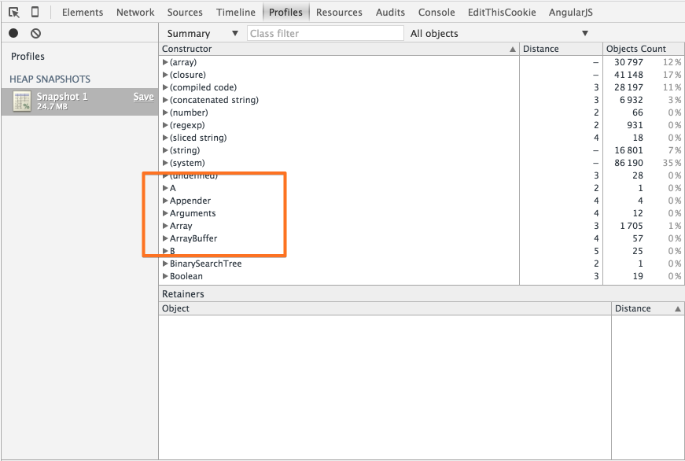

  이 글에서는, 생성된 **객체**가 **GC** 에 의해, **소멸되는 시점**에 대해 테스트해볼 것이다.<br/><br/>

- Global Execution Context 내부
  
  -  테스트 1
  
        ```javascript
        
        // global execution context
        function A(){}
        
        // A 생성자 함수 객체를 통해 새로운 객체를 생성한다.
        var obj = new A();
        
        console.log(obj) // object Object
        ```
        
    - HEAP MEMORY CHECK
    
      - 해당 **객체**가 **Heap Memory 영역**에 존재하는것을 볼 수 있다.
        
        
            
  -  테스트 2            
    
        ```javascript
        // global execution context
        function A(){}
        
        // A 생성자 함수 객체를 통해 새로운 객체를 생성한다.
        var obj = new A();
         
        // obj 변수에 null 값을 할당하여, 생성된 객체를 GC 대상으로 만든다.
        obj = null;
        
        console.log(obj) // null
        ```
    
    - HEAP MEMORY CHECK
    
      - <code style="background:#d1cccc">obj = null</code> 코드를 통해, 해당 **객체**를 **GC** 대상으로 만들었다.
      
      - 해당 **객체**가 **Heap Memory 영역**에서 **소멸**된 것을 볼 수 있다.
        
        

  -  테스트 3            
    
        ```javascript
        // global execution context
        function A(){}
        
        // A 생성자 함수 객체를 통해 새로운 객체를 생성한다.
        var obj = new A();
        
        // x 변수에 obj 값(객체 참조 포인터)을 할당한다.
        var x = obj;
        
        // obj 변수에 null 값을 할당하여, 생성된 객체를 GC 대상으로 만든다.
        obj = null;
        
        // 해당 객체(new A())를 참조하는 대상(x 변수)이 아직 남아있기때문에, GC 에 의해 Heap Memory 영역에서 소멸되지않는다.
        console.log(x) // obj Object
        ```
    
    - HEAP MEMORY CHECK
    
      - 해당 **객체**를 참조하는 **대상**이 아직 남아있기때문에, **GC** 에 의해 **Heap Memory** 영역에서 소멸되지않는다.
        
        
            
  -  테스트 4           
    
        ```javascript
        // global execution context
        function A(){}
        
        // A 생성자 함수 객체를 통해 새로운 객체를 생성한다.
        var obj = new A();
        
        // x 변수에 obj 값(객체 참조 포인터)을 할당한다.
        var x = obj;
        
        // obj 변수에 null 값을 할당하여, 생성된 객체를 GC 대상으로 만든다.
        obj = null;
        
        // x 변수에 null 값을 할당하여, 생성된 객체를 GC 대상으로 만든다.
        x = null;
        
        // x 변수에 새롭게 할당된 null 값이 반환된다.
        console.log(x) // null
        ```
    
    - HEAP MEMORY CHECK
    
      - 해당 **객체**를 참조하는 대상이 모두 사라졌기때문에, **객체**가 **Heap Memory 영역**에서 **소멸**된 것을 볼 수 있다.
        
        
                        
  - 반드시 **null** 값만 할당해야 하는가?          
    
    ```javascript
    // global execution context
    function A(){}
    
    // A 생성자 함수 객체를 통해 새로운 객체를 생성한다.
    var obj = new A();
    
    // obj 변수에 다른 값을 할당하여, 생성된 객체를 GC 대상으로 만든다.
    obj = 1;
    
    console.log(obj) // 1
    ```

    - HEAP MEMORY CHECK
    
      - **null** 값이 아닌, 다른 값을 할당해도, **객체**는 **Heap Memory 영역**에서 **소멸**된다.
        
                                

- Function Execution Context 내부
    
  - x 변수에는 obj 변수에 할당된 **객체 참조 포인터**(값)가 할당된다. 
  
    ```javascript
    // global execution context
    
    // obj 변수에 객체를 할당한다.
    var obj = {x: 1};
    
    function B(){
    
        // function execution context
        
        // x 변수를 obj 변수 값으로 초기화한다.
        // obj 변수 값: 객체 참조 포인터
        var x = obj;
    
        // x 변수를 통해, 객체를 확장한다.
        x.y = 2;
    
        console.log(obj); // {x: 1, y: 2}
    }
    
    B();
    ```
  - 테스트 1          
    
    ```javascript
    // global execution context
    function A(){};
    
    // A 생성자 함수 객체를 통해 새로운 객체를 생성한다.
    var obj = new A();
    
    function B(){
    
        // function execution context
        
        // obj 변수에 null 값을 할당하여, 생성된 객체를 GC 대상으로 만든다.
        obj = null;
    
        console.log(obj);
    }
    
    B();
    ```
    
    - HEAP MEMORY CHECK
    
      - 예상했던대로, **객체**는 **Heap Memory 영역**에서 **소멸**된다.
        
        

  - 테스트 2        
    
    ```javascript
    // global execution context
    
    function A(){};
    
    // A 생성자 함수 객체를 통해 새로운 객체를 생성한다.
    var obj = new A();
    
    function B(){
    
        // function execution context
    
        var x = obj;
        // obj 변수에 null 값을 할당하여, 생성된 객체를 GC 대상으로 만든다.
        obj = null;
    
        console.log(obj); // null
    
        // 해당 객체(new A())를 참조하는 대상(x 변수)이 아직 남아있기때문에, GC 에 의해 Heap Memory 영역에서 소멸되지않았다.
        console.log(x); // object Object
    }
    
    B();
    ```
    
    - HEAP MEMORY CHECK
    
      - 함수 종료 후(== <span style="color:#c11f1f">AO</span> 가 소멸되는 시점)에는 해당 **객체**를 참조하는 대상이 모두 사라졌기때문에, **객체**가 **Heap Memory 영역**에서 **소멸**된 것을 볼 수 있다.
        
        
            
  - 테스트 3        
    
    ```javascript
    // global execution context
    
    function A(){};
    
    // A 생성자 함수 객체를 통해 새로운 객체를 생성한다.
    var obj = new A();
    
    function B(){
    
        // function execution context
    
        // x 는 globalExecutionContext 내부 VO 의 새로운 속성으로 추가된다.
        x = obj; // === this.x = obj;
        // obj 변수에 null 값을 할당하여, 생성된 객체를 GC 대상으로 만든다.
        obj = null;
    
        console.log(obj); // null
    
        // 해당 객체(new A())를 참조하는 대상(x 변수)이 아직 남아있기때문에, GC 에 의해 Heap Memory 영역에서 소멸되지않았다.
        console.log(x); // object Object
    }
    
    B();
    ```
    
    - HEAP MEMORY CHECK
    
      - 이 같은 경우, 함수 종료 후(== <span style="color:#c11f1f">AO</span> 가 소멸되는 시점)에도 해당 **객체**를 참조하는 대상(globalExecutionContext.VO.x)이 아직 남아있기때문에, **객체**가 **Heap Memory 영역**에서 **소멸**되지 않는다.
        
                    
    
## 테스트 결과
    
- <code style="background:#d1cccc">var x = obj</code> 코드를 통해, x 변수에는 obj 변수에 할당된 **객체 포인터(값)**가 할당된다.<p>

- 생성된 **객체**는 그 **객체**를 참조하는 대상이 없을경우에만 **GC** 에 의해, **Heap Memory 영역**에서 **소멸**된다.<p>

  - 즉 **null**(or 다른 값) 값만 **할당**한다고 무조건 **소멸**되는 것은 아니다.

- **null** 값이 아닌, 다른 값을 할당해도, **객체**는 **Heap Memory 영역**에서 **소멸**된다.

- JS 는 개발자가 직접 **Heap Memory 영역**에 할당된 **객체**를 **소멸**시킬 수 있는 방법을 제공하지 않는다. 

  - 즉 <code style="background:#d1cccc">null</code> 값을 **할당**하거나, <code style="background:#d1cccc">delete</code> 연산자를 통해 <span style="color:#c11f1f">VO</span> 의 속성을 **삭제**하는것은, 모두 **간접**적으로 **GC**를 통해, **객체**를 **소멸**시키는 **방법**들이다.<p>
  
- <span style="color:#c11f1f">AO</span> 의 속성으로 할당된 **객체 참조**는 **함수 종료 시** 모두 **GC** 에 의해 **소멸**된다.<p>


## 참조 URL

- [Variable in JS](http://mohwa.github.io/blog/javascript/2015/10/14/variable-inJS/)

- [Variable Object in JS](http://mohwa.github.io/blog/javascript/2015/10/14/vo-inJS/)

- [Scope Chain 그리고 Closure](http://mohwa.github.io/blog/javascript/2015/10/11/scope-chain-inJS/)

- [Struct in JS](http://mohwa.github.io/blog/designpattern/2015/08/07/struct-inJS/)
