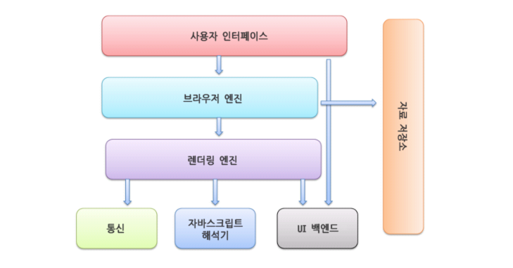
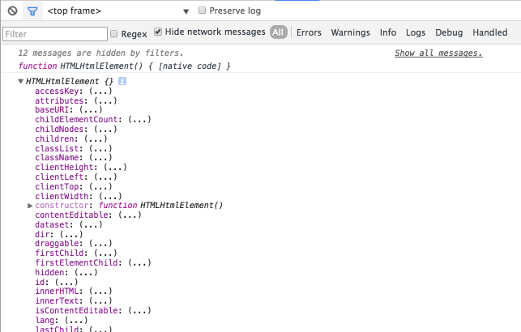
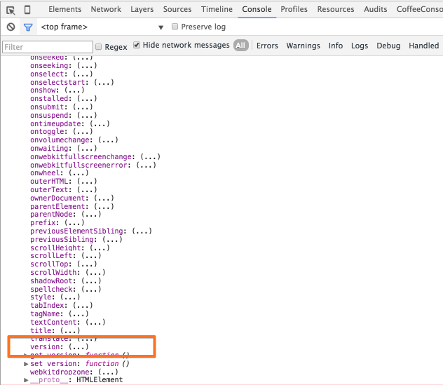
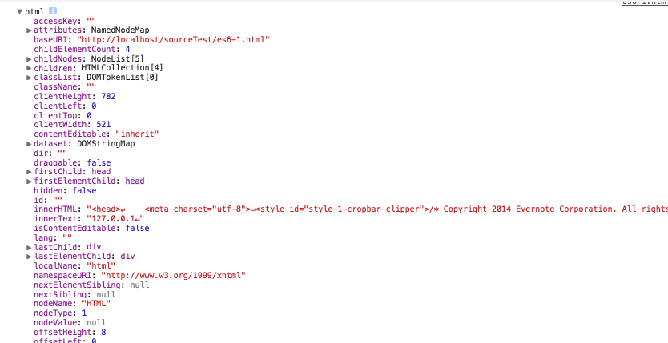
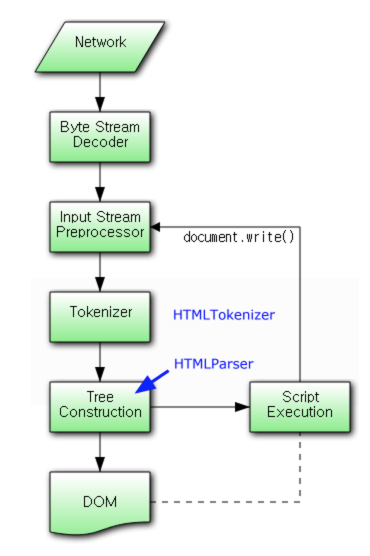
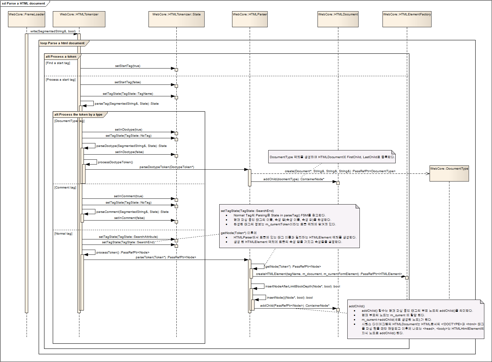

## 1. DOM 이라는 단어가 가진 [모호](http://krdic.naver.com/detail.nhn?docid=13706300)성 

- **DOM** 은 바라보는 <span style="color:#c11f1f">관점</span>에 따라 여러가지로 표현될 수 있다.

  - *문서의 성격에 따라 DOM 을 다르게 표현하는 가장 큰 이유 중 하나이다.*

## 2. 용어 정리

- 브라우저의 주요 구성 요소



- <span style="color:#c11f1f">[인터페이스](https://ko.wikipedia.org/wiki/%EC%9D%B8%ED%84%B0%ED%8E%98%EC%9D%B4%EC%8A%A4) 관점</span>에서 바라본 DOM: **DOM** Interfaces([Attr](https://developer.mozilla.org/en-US/docs/Web/API/Attr), [Document](https://developer.mozilla.org/en-US/docs/Web/API/Document) Interface 등), **HTML** Interfaces([HTMLHtmlElement](https://developer.mozilla.org/en-US/docs/Web/API/HTMLHtmlElement) Interface 등), **SVG** Interfaces([SVGAElement](https://developer.mozilla.org/en-US/docs/Web/API/SVGAElement) Interface 등) 등을 포함한 <span style="color:#c11f1f">Programing Interface</span> 를 의미한다.<p />

- <span style="color:#c11f1f">[API](https://ko.wikipedia.org/wiki/API) 관점</span>에서 바라본 DOM: 특정 [플랫폼](https://ko.wikipedia.org/wiki/%EC%BB%B4%ED%93%A8%ED%8C%85_%ED%94%8C%EB%9E%AB%ED%8F%BC) 상에서 특정 **언어**(C++, JAVA, JS 등)를 통해 <span style="color:#c11f1f">Programing Interface</span> 를 구현한 <span style="color:#c11f1f">API</span> 를 의미한다.<p />

  - 구현된 **API** 는 두 가지 형태로 나눌 수 있다.
  
      - 엔진 내부에 구현된 API<p>
          
          - webkit 엔진은 **C++** 언어를 통해 <span style="color:#c11f1f">Programing Interface</span> 를 구현한 <span style="color:#c11f1f">API</span> 를 사용한다.<p>
          
              - 해당 인터페이스를 작성하기 위해 <a href="https://ko.wikipedia.org/wiki/%EC%9D%B8%ED%84%B0%ED%8E%98%EC%9D%B4%EC%8A%A4_%EC%A0%95%EC%9D%98_%EC%96%B8%EC%96%B4">인터페이스 정의 언어</a>(*.idl) 를 사용한다.<p>
        
              - <a href="https://github.com/WebKit/webkit/blob/master/Source/WebCore/dom/Document.idl">Document.idl</a>, <a href="https://github.com/WebKit/webkit/blob/master/Source/WebCore/dom/Document.h">Document.h</a>, <a href="https://github.com/WebKit/webkit/blob/master/Source/WebCore/dom/Document.cpp">Document.cpp</a><p>
              
              - <a href="https://github.com/WebKit/webkit/blob/master/Source/WebCore/html/HTMLHtmlElement.idl">HTMLHtmlElement.idl</a>, <a href="https://github.com/WebKit/webkit/blob/master/Source/WebCore/html/HTMLHtmlElement.h">HTMLHtmlElement.h</a>, <a href="https://github.com/WebKit/webkit/blob/master/Source/WebCore/html/HTMLHtmlElement.cpp">HTMLHtmlElement.cpp</a><p>
                  
        - **DOM 트리**(or [Parse 트리](https://ko.wikipedia.org/wiki/%EA%B5%AC%EB%AC%B8_%EB%B6%84%EC%84%9D))를 JS 로 제어하기위해 구현된 API(즉 문서(HTML 등)의 Element 를 제어하기 위한 API 이다)<p>
        
          - [HTMLHtmlElement](https://developer.mozilla.org/en-US/docs/Web/API/HTMLHtmlElement) 인터페이스 명세에는, 문서의 DTD [version](https://developer.mozilla.org/en-US/docs/Web/API/HTMLHtmlElement/version) 정보를 반환받기 위한 속성이 명세되어있으며, 이 속성은 아래와 같이 구현되어있다.
          
              - *HTMLHtmlElement 는 root element(html)를 위한 인터페이스이다.*<p>
          
                  ```javascript
                  // HTMLHtmlElement 생성자 함수 객체
                  console.log(HTMLHtmlElement);
              
                  // HTMLHtmlElement 생성자 함수 객체의 원형
                  console.log(HTMLHtmlElement.prototype);
                  ```    
                  
                  
                  
                  원형(prototype) 객체 내부에는 **version** 속성이 구현되어있다.
                  
                         
                                             
                  또한 html element 를 가리키는 [Document.documentElement](https://developer.mozilla.org/en-US/docs/Web/API/Document/documentElement) 객체를 통해, **version** 정보를 가져올 수 있다.
          
                  ```javascript
                  
                  console.log(document.documentElement); // html element object
                  
                  console.log(document.documentElement.version); // dtd version
                  ```              
                  
                  
                  
            - [Document.documentElement](https://developer.mozilla.org/en-US/docs/Web/API/Document/documentElement) 객체의 \_\_proto\_\_ 속성은 HTMLHtmlElement 함수 객체의 원형(prototype) 을 가리키고 있다.
            
              - 즉 document.documentElement 객체는 HTMLHtmlElement 생성자 함수 객체로 생성된 **객체**라는것을 알 수 있다.<p>
              
                  ```javascript
                  // 위임 과정을 통해 HTMLHtmlElement.prototype 객체가 생성된 document.documentElement 객체의 __proto__ 속성으로 위임된다.
                  console.dir(document.documentElement.__proto__ === HTMLHtmlElement.prototype); // true
                  ```                                      
                  
                  [객체 지향 언어의 두 가지 줄기](http://mohwa.github.io/blog/javascript/2015/10/16/prototype/)
                                    
            - Element 를 생성하기 위한 모든 생성자 함수(HTMLHtmlElement, HTMLHeadElement 등) 객체는 명시적으로 호출 할 수 없으며, 원형 객체의 속성에도 접근할 수 없다.
                                                
              - <em>Element 생성자 함수 객체에 대한, **접근 권한**을 두고 있는듯 하다.</em><p>
              
                ```javascript
                try {
                
                    // HTMLHtmlElement 생성자 함수 객체를 호출한다.
                    console.dir(HTMLHtmlElement());
                }
                catch(e){
                    console.log(e.message); // Illegal constructor
                }
            
                try {
                    // 원형(prototype) 객체에 구현된 version 속성에 접근한다.
                    console.dir(HTMLHtmlElement.prototype.version);
                }
                catch(e){
                    console.log(e.message); // llegal invocation
                }
            
            
                try {
                    // HTMLHeadElement 생성자 함수 객체를 호출한다.
                    console.dir(new HTMLHeadElement());
                }
                catch(e){
                    console.log(e.message); // Illegal constructor
                }
                ```

            - [document.createElement](https://developer.mozilla.org/ko/docs/Web/API/Document/createElement) 함수는 암묵적으로 Element 를 생성하기위한 방법 중 하나이다.
            
                ```javascript
                
                // 암묵적으로 html element 를 생성할 수 있다.
                var html = document.createElement('html');
                
                console.log(html.version); // dtd version
                ```

## 3. 어휘 분석과 구문 분석 과정

- 문서 분석 과정



- DOM 트리(or [Parse 트리](https://ko.wikipedia.org/wiki/%EA%B5%AC%EB%AC%B8_%EB%B6%84%EC%84%9D)) 생성 과정을 이해하기위해서는, 먼저 문서를 분석하는 과정인 <span style="color:#c11f1f">어휘 분석</span>과 <span style="color:#c11f1f">구문 분석</span> 과정을 이해해야한다.

- 어휘분석(lexical analysis): 문서의 내용을 의미 있는 문자(**태그**)로 분리하여 <span style="color:#c11f1f">토큰화</span> 시키는 과정을 말한다.<p>
    
    - <em>생성된 토큰은 태그 이름, 속성 이름, 속성 값이 포함된 객체로 나타낼 수 있다.</em>

        ```javascript
        var token = {tagName: 'a', attrs: [{name: 'href', value: 'http://google.com'}, {name: 'target', value: '_blank'}]};
        ```
        
- 구문분석(syntax analysis): 생성된 <span style="color:#c11f1f">토큰</span>을 [Parser](https://ko.wikipedia.org/wiki/%EA%B5%AC%EB%AC%B8_%EB%B6%84%EC%84%9D)(구문 분석기)를 통해, <span style="color:#c11f1f">노드화</span>(노드 객체) 시킨 후 DOM 트리에 추가시키는 과정을 말한다.

## 4. DOM 트리 생성 과정

- HTML 파싱 시퀀스 다이어그램

    

- 브라우저는 디스크나 네트워크를 통해 해당 문서를 [바이트 코드](http://m.terms.naver.com/entry.nhn?docId=844067&cid=42346&categoryId=42346)로 읽어드린 후, 지정된 인코딩 값(or **방식**)에 따라 원시 데이터인 <span style="color:#c11f1f">문자열</span>로 변환한다.

    - <em>바이트 코드: 프로그램이 컴파일된 형태</em>


- 변환된 <span style="color:#c11f1f">문자열</span>을 의미 있는 문자(**태그**)로 분리하여 <span style="color:#c11f1f">토큰화</span> 시킨다.

- <span style="color:#c11f1f">토큰</span>이 가진 tagName 과 일치하는 HTMLElement 를 생성 후 해당 속성을 추가시킨다.

- 부모 노드의 자식 노드로 생성된 HTMLElement 를 추가 시킨다(즉 DOM 트리에 반영시킨다)<p>

    ```javascript
    // tagName 을 통해 Element 를 생성한다.
    var elem = createHTMLElement(token.tagName);
    
    // 속성을 추가 시킨다.
    elem.setAttrs(token.attrs);
    
    
    // 부모 노드의 자식 노드로 해당 Element 를 추가 시킨다.
    parentNode.appendChild(elem);
    ```
    


## 관련 URL

- [MDN Document Object Model (DOM)](https://developer.mozilla.org/en-US/docs/Web/API/Document_Object_Model)

- [What is the Document Object Model?](http://www.w3.org/TR/DOM-Level-2-Core/introduction.html)

- [W3C Document Object Model (DOM)](http://www.w3.org/DOM/)

- [DOM을 구현한다는 표현은 반드시 binding이 되어야 할까요?](http://okjungsoo.tistory.com/entry/DOM%EC%9D%84-%EA%B5%AC%ED%98%84%ED%95%9C%EB%8B%A4%EB%8A%94-%ED%91%9C%ED%98%84%EC%9D%80-%EB%B0%98%EB%93%9C%EC%8B%9C-binding%EC%9D%B4-%EB%90%98%EC%96%B4%EC%95%BC-%ED%95%A0%EA%B9%8C%EC%9A%94)

- [객체 모델 생성](https://developers.google.com/web/fundamentals/performance/critical-rendering-path/constructing-the-object-model?hl=ko)

- [브라우저와 dom 관련](http://okky.kr/article/112613)

- [인터프리터언어 와 컴파일언어의 뜻](http://seodh007.tistory.com/entry/%EC%9D%B8%ED%84%B0%ED%94%84%EB%A6%AC%ED%84%B0%EC%96%B8%EC%96%B4-%EC%99%80-%EC%BB%B4%ED%8C%8C%EC%9D%BC%EC%96%B8%EC%96%B4%EC%9D%98-%EB%9C%BB)

- [[WebKit] Parse a HTML document](http://haejung.egloos.com/v/1250745)

- [브라우저는 어떻게 동작하는가?](http://d2.naver.com/helloworld/59361)


