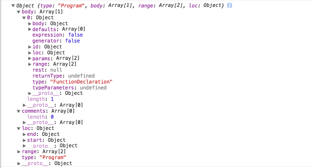
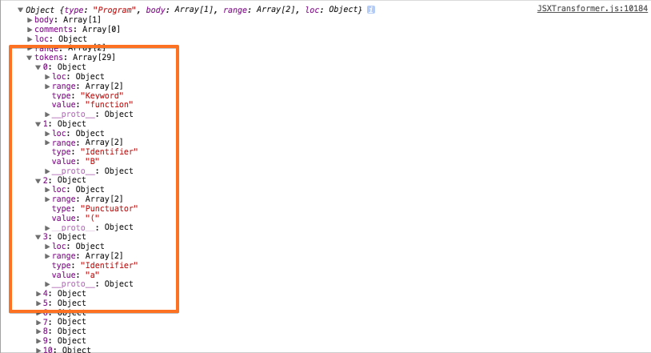
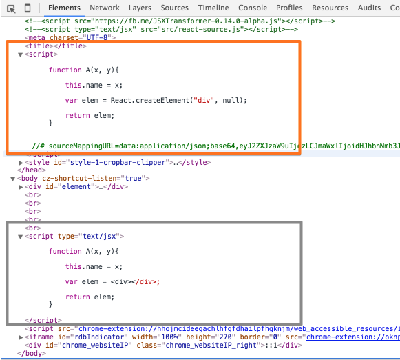
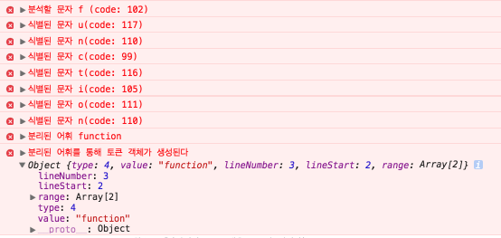
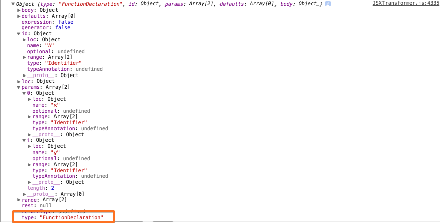
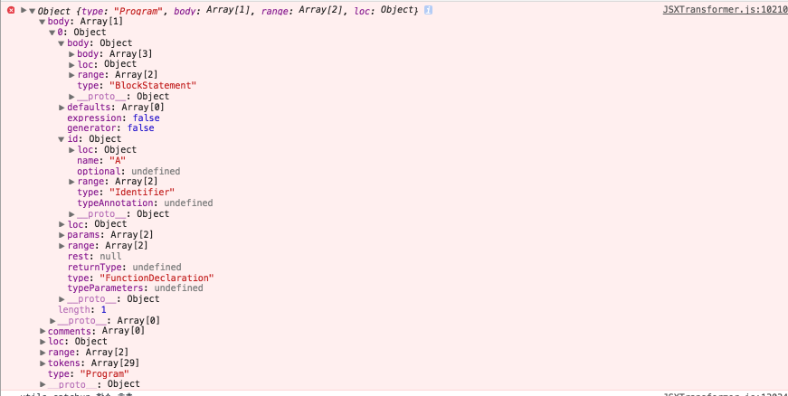
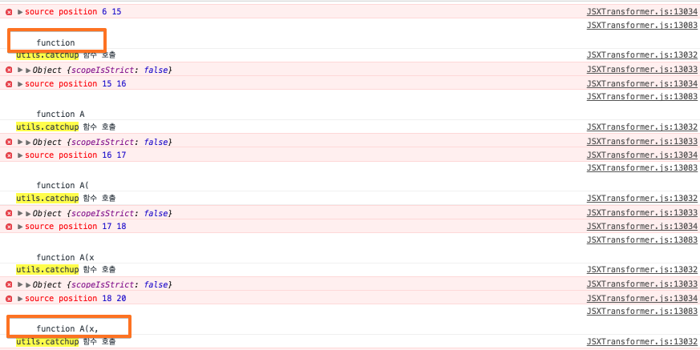
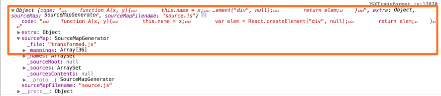

## 1. [JSXTransformer](https://facebook.github.io/react/blog/2015/06/12/deprecating-jstransform-and-react-tools.html)

- JSXTransformer 내부에서 사용되는 [Esprima-FB](https://github.com/facebookarchive/esprima) 파서는 기존 [Esprima](https://github.com/ariya/esprima/tree/harmony) 파서를 확장([JSX 명세](https://github.com/facebook/jsx)) 구현한 버전이다.

  - 현재 버전은 <span style="color:#c11f1f">15001.1001.0-dev-harmony-fb</span> 이며, 분석된 내용은 <span style="color:#c11f1f">13001.1001.0-dev-harmony-fb</span> 버전을 따른다.<p>
  
  - [JSXTransformer CDN](https://fbcdn-dragon-a.akamaihd.net/hphotos-ak-xtf1/t39.3284-6/11057100_835863049837306_1087123501_n.js)
  
- 생성된 [Parse 트리](https://ko.wikipedia.org/wiki/%EA%B5%AC%EB%AC%B8_%EB%B6%84%EC%84%9D) 구조는 모질라의 [Parser AST](https://developer.mozilla.org/en-US/docs/Mozilla/Projects/SpiderMonkey/Parser_API) 인터페이스 명세를 따르고 있다.(or **구현**되어있다)<p>
  
  - [Program Interface 명세](https://github.com/estree/estree/blob/master/spec.md#programs)
  
    
  
- 소스상의 parser 옵션 수정하여, (파서를 통해)수집된 토큰을 반환받을 수 있다.<p>

    ```javascript
    
    function getAstForSource(source, options) {
        if (_astCache[source] && !options.disableAstCache) {
            return _astCache[source];
        }
        var ast = esprima.parse(source, {
            // 아래와 같이 tokens 속성을 추가 한다.
            tokens: true,
            comment: true,
            loc: true,
            range: true,
            sourceType: options.sourceType
        });
        if (!options.disableAstCache) {
            _astCache[source] = ast;
        }
        return ast;
    }
    ```          
          
    
  
- [Esprima 공식 홈페이지](http://esprima.org/)

- [The ESTree Spec](https://github.com/estree/estree)<p>

- [JSX Tree Spec](https://github.com/facebook/jsx/blob/master/AST.md)

## 2. 소스 수집 및 [Parse 트리](https://ko.wikipedia.org/wiki/%EA%B5%AC%EB%AC%B8_%EB%B6%84%EC%84%9D) 가 생성되는 과정

- 아래 소스는 <em>[Parser](https://github.com/facebookarchive/esprima)</em> 에 의해 파싱될 <span style="color:#c11f1f">원본 소스</span>이다.

    ```javascript
    <script type="text/jsx">
    
        function A(x, y){
    
            this.name = x;
    
            var elem = <div></div>;
    
            return elem;
        }
    
    </script>
    ```

- 소스 수집 과정

  - 기본적으로 <span style="color:#c11f1f"><em>text/jsx</em></span> 타입을 가진 <em>Script Element</em> 내부 소스(or 코드)는 브라우저에 의해 처리되지않는다.
  
      ```html
      <script type="text/jsx">
          console.log('이 실행 코드는 브라우저에 의해 처리되지 않는다....');
      </script>
      ```
            
  - <span style="color:#c11f1f"><em>text/jsx</em></span> 타입을 가진 모든 <em>Script Element</em> 를 수집한다.
    
      ```javascript

      function runScripts() {

          var scripts = document.getElementsByTagName('script');

          // Array.prototype.slice cannot be used on NodeList on IE8
          var jsxScripts = [];
          for (var i = 0; i < scripts.length; i++) {
              if (/^text\/jsx(;|$)/.test(scripts.item(i).type)) {
                  jsxScripts.push(scripts.item(i));
              }
          }

          ...


          // loadScripts 함수를 호출하여, script element 내부에 포함된 원본 소스를 가져온다.
          loadScripts(jsxScripts);
      }

      ```
          
  - 만약 inline code 로 작성된 경우에는 <em>script.innerHTML</em> 속성 값을 통해 소스를 가져오고, <em>script.src</em> 속성 값이 있는 경우에는 <span style="color:#c11f1f"><em>xhr</em></span> 을 통해 가져온다.
       
      ```javascript

      // script.src 속성 값이 있는 경우
      if (script.src) {
        result[i] = {
            async: async,
            error: false,
            executed: false,
            content: null,
            loaded: false,
            url: script.src,
            options: options
        };

        // xhr 을 통해 해당 소스를 가져온다.
        load(script.src, function(content) {

            result[i].loaded = true;
            // content === source code
            result[i].content = content;
            check();
        }, function() {
            result[i].error = true;
            check();
        });

    } else {

        // inline code 로 작성된 경우..
        result[i] = {
            async: async,
            error: false,
            executed: false,
            content: script.innerHTML,
            loaded: true,
            url: null,
            options: options
        };
    }
    ```

  - 수집된 <span style="color:#c11f1f">원본 소스</span>는 <em>[Parser](https://github.com/facebookarchive/esprima)</em> 를 통해 **파싱**된 후, 새로운 <em>Script Element</em> 를 통해 로드 및 실행된다.
    
      - <em>즉 생성된 Script Element 에 할당된 소스는 <span style="color:#c11f1f">파싱된 소스</span>를 가리킨다.</em><p>
  
      ```javascript
      function run(code, url, options) {

          // script element 를 생성한다.
          var scriptEl = document.createElement('script');
          // transformCode 함수를 통해 파서가 호출된다.
          scriptEl.text = transformCode(code, url, options);

          // 파서에 의해 파싱된 소스
          console.log(scriptEl.text);

          // header element 의 자식 element 로 추가 시킨다.
          headEl.appendChild(scriptEl);
      }
      ```

  - <span style="color:#c11f1f">파싱된 소스</span> 및 <span style="color:#c11f1f">원본 소스</span>
  
    ```javascript
    // 파서를 통해 파싱된 소스
    function A(x, y){

     this.name = x;

     var elem = React.createElement("div", null);

     return elem;
    }
    ```

    

- [Parse 트리](https://ko.wikipedia.org/wiki/%EA%B5%AC%EB%AC%B8_%EB%B6%84%EC%84%9D) 생성 과정

  - <span style="color:#6298c1">transformCode</span> 함수가 호출된 후, 여러 단계(<span style="color:#6298c1">transformReact</span>... , <span style="color:#6298c1">transform</span> 등)를 거쳐, esprima.parse 함수를 통해, <em>Parse</em> 트리(AST)를 생성하는 함수인 <span style="color:#6298c1">getAstForSource</span> 함수를 호출하게 된다.
  
    ```javascript
    function getAstForSource(source, options) {
        if (_astCache[source] && !options.disableAstCache) {
            return _astCache[source];
        }

        // esprima 파서를 호출한다.(최종 파스 트리를 반환받는다)
        var ast = esprima.parse(source, {
            comment: true,
            loc: true,
            range: true,
            sourceType: options.sourceType
        });
        if (!options.disableAstCache) {
            _astCache[source] = ast;
        }

        // 생성된 파스 트리를 반환한다.
        return ast;
    }
    ```

  - 먼저 <span style="color:#6298c1">esprima.parse</span> 함수가 호출되면, (여러 단계를 거친 후...)<span style="color:#6298c1"> advance</span> 함수를 통해 <span style="color:#c11f1f">원본 소스</span>에 포함된 각 문자(Char)의 의미를 분석 후, 분리된 토큰(어휘)을 객체화 시킨다.(<em>내부적으로는 더 많은 단계를 거치게된다</em>)

    -  <span style="color:#6298c1">advance</span> 함수 내부
    
        ```javascript
    
        function advance() {
    
            var ch;
    
            if (!state.inJSXChild) {
                skipComment();
            }
    
            // 소스 분석이 종료되는 시점
            // 현재 index(코드의 위치)가 length(포함된 소스의 전체 길이) 보다 크거나 같을경우
            if (index >= length) {
                return {
                    type: Token.EOF,
                    lineNumber: lineNumber,
                    lineStart: lineStart,
                    range: [index, index]
                };
            }
    
            // state.inJSXChild 가 true 인 경우(tag 열림('<') 상태가, 닫힘('>') 상태로 변경되었을 경우)
            // 즉 div element 가 닫힘('>') 문자로 인해 닫힌경우(단 열림('<') 문자 뒤에 '/' 문자가 오는 경우는 제외된다)
            if (state.inJSXChild) {
                return advanceJSXChild();
            }
    
            // 원본 소스에 포함된 각 문자(Char)를 아스키 코드로 변환한다.
            ch = source.charCodeAt(index);
    
    
            /*
              변환된 아스키 코드를 식별 후, 각 token 객체를 생성한다.
            */
    
            // Very common: ( and ) and ;
            if (ch === 40 || ch === 41 || ch === 58) {
                return scanPunctuator();
            }
    
            // String literal starts with single quote (#39) or double quote (#34).
            if (ch === 39 || ch === 34) {
                if (state.inJSXTag) {
                    return scanJSXStringLiteral();
                }
                return scanStringLiteral();
            }
    
            if (state.inJSXTag && isJSXIdentifierStart(ch)) {
                return scanJSXIdentifier();
            }
    
            if (ch === 96) {
                return scanTemplate();
            }
    
            // 해당 문자의 의미를 분석 후, 토큰 객체를 생성한다.
            if (isIdentifierStart(ch)) {
                return scanIdentifier();
            }
    
            // Dot (.) char #46 can also start a floating-point number, hence the need
            // to check the next character.
            if (ch === 46) {
                if (isDecimalDigit(source.charCodeAt(index + 1))) {
                    return scanNumericLiteral();
                }
                return scanPunctuator();
            }
    
            if (isDecimalDigit(ch)) {
                return scanNumericLiteral();
            }
    
            // Slash (/) char #47 can also start a regex.
            if (extra.tokenize && ch === 47) {
                return advanceSlash();
            }
    
            return scanPunctuator();
        }
        ```
            
  - 예를들어, 위 <span style="color:#6298c1">isIdentifierStart</span> 함수로 해당 <span style="color:#c11f1f">아스키 코드</span>(문자)의 [의미](https://ko.wikibooks.org/wiki/%EC%8B%9D%EB%B3%84%EC%9E%90)를 분석 후, <span style="color:#6298c1">scanIdentifier</span> 함수를 통해 <span style="color:#c11f1f">토큰</span>(어휘) 객체를 생성한다.

      - <span style="color:#6298c1">isIdentifierStart</span> 함수 내부
      
          ```javascript
          function isIdentifierStart(ch) {
              // 해당 아스키 코드의 의미를 분석한다.
              return (ch === 36) || (ch === 95) ||  // $ (dollar) and _ (underscore)
                  (ch >= 65 && ch <= 90) ||         // A..Z
                  (ch >= 97 && ch <= 122) ||        // a..z
                  (ch === 92) ||                    // \ (backslash)
                  ((ch >= 0x80) && Regex.NonAsciiIdentifierStart.test(String.fromCharCode(ch)));
          }
          ```
              
      - <span style="color:#6298c1">scanIdentifier</span> 함수 내부
      
          ```javascript
          function scanIdentifier() {

              var start, id, type;

              start = index;


              // Backslash (char #92) starts an escaped character.

              /*

              // 토큰 타입
              Token = {
                  BooleanLiteral: 1,
                  EOF: 2,
                  Identifier: 3,
                  Keyword: 4,
                  NullLiteral: 5,
                  NumericLiteral: 6,
                  Punctuator: 7,
                  StringLiteral: 8,
                  RegularExpression: 9,
                  Template: 10,
                  JSXIdentifier: 11,
                  JSXText: 12
              };

              */
              // 식별된 토큰이 id 변수로 할당된다.
              // 예: function(분리된 토큰 문자열)
              id = (source.charCodeAt(index) === 92) ? getEscapedIdentifier() : getIdentifier();


              // There is no keyword or literal with only one character.
              // Thus, it must be an identifier.

              // 해당 토큰 타입을 설정한다.(식별자, 키워드, 일부 literal(null, boolean))
              if (id.length === 1) {
                  type = Token.Identifier;
              } else if (isKeyword(id)) {
                  type = Token.Keyword;
              } else if (id === 'null') {
                  type = Token.NullLiteral;
              } else if (id === 'true' || id === 'false') {
                  type = Token.BooleanLiteral;
              } else {
                  type = Token.Identifier;
              }

              // 생성된 토큰 객체를 반환한다.
              return {
                  type: type, // 4(Keyword)
                  value: id, // 'function'
                  lineNumber: lineNumber, // 3
                  lineStart: lineStart, // 2
                  range: [start, index] // 6, 14
              };
          }
          ```

          
              
  - 생성된 <span style="color:#c11f1f">토큰</span>(어휘) 객체를 통해 <em>Parse</em>(AST) 트리 구성을 위한 <span style="color:#c11f1f">노드</span>가 구성된다.

    - [FunctionDeclaration 명세](https://github.com/estree/estree/blob/master/spec.md#functiondeclaration)
          
      ```javascript
      interface FunctionDeclaration <: Function, Declaration {
          // 노드 타입
          type: "FunctionDeclaration";
          // 해당 함수 선언식에 대한 식별자 정보
          id: Identifier;
      }
      ```
    - <span style="color:#6298c1">parseFunctionDeclaration</span> 함수 내부
          
        ```javascript
        
        function parseFunctionDeclaration() {
           
            var id, body, token, tmp, firstRestricted, message, generator, isAsync,
                previousStrict, previousYieldAllowed, previousAwaitAllowed,
                marker = markerCreate(), typeParameters;
    
            isAsync = false;
            if (matchAsync()) {
                lex();
                isAsync = true;
            }
    
            expectKeyword('function');
    
            generator = false;
            if (match('*')) {
                lex();
                generator = true;
            }
    
            token = lookahead;
    
            id = parseVariableIdentifier();
    
            ...
    
            tmp = parseParams(firstRestricted);
            firstRestricted = tmp.firstRestricted;
            if (tmp.message) {
                message = tmp.message;
            }
    
            ...
    
            body = parseFunctionSourceElements();
    
            ...
   
            // 함수 선언식에 대한 Parse 트리 노드를 생성한다.
            return markerApply(
                marker,
                delegate.createFunctionDeclaration(
                    id,
                    tmp.params,
                    tmp.defaults,
                    body,
                    tmp.rest,
                    generator,
                    false,
                    isAsync,
                    tmp.returnType,
                    typeParameters
                )
            );
        }
        ```
    
        
        
  - 각 <span style="color:#c11f1f">노드</span>가 조합되어, 최종 <em>Parse</em> 트리가 생성된다.

    

  - <span style="color:#6298c1">utils.append</span>, <span style="color:#6298c1">utils.catchup</span> 함수(또 다른 함수 등)로 각 <span style="color:#c11f1f">노드</span> 객체 및 <span style="color:#c11f1f">state</span> 등을 전달하여, 최종 결과물인 <span style="color:#c11f1f">파싱된 소스</span>를 만들어 간다.(즉 source buffer 를 채워나간다)

      - <span style="color:#6298c1">utils.append</span> 함수 내부
              
          ```javascript

          /**
           * Appends a string of text to the buffer
           *
           * @param {string} str
           * @param {object} state
           */
          function append(str, state) {

              if (state.g.sourceMap && str) {
                  state.g.sourceMap.addMapping({
                      generated: { line: state.g.bufferLine, column: state.g.bufferColumn },
                      original: { line: state.g.sourceLine, column: state.g.sourceColumn },
                      source: state.g.sourceMapFilename
                  });
                  var transformedLines = str.split('\n');
                  if (transformedLines.length > 1) {
                      state.g.bufferLine += transformedLines.length - 1;
                      state.g.bufferColumn = 0;
                  }
                  state.g.bufferColumn +=
                      transformedLines[transformedLines.length - 1].length;
              }
              state.g.buffer += str;

              console.log(state.g.buffer);
          }
          ```
              
      - <span style="color:#6298c1">utils.catchup</span> 함수 내부
              
          ```javascript

          /**
           * Given a state fill the resulting buffer from the original source up to
           * the end
           *
           * @param {number} end
           * @param {object} state
           * @param {?function} contentTransformer Optional callback to transform newly
           *                                       added content.
           */
          function catchup(end, state, contentTransformer) {

              console.log('utils.catchup 함수 호출');
              console.error(state);
              console.error('source position', state.g.position, end);

              if (end < state.g.position) {
                  // cannot move backwards
                  return;
              }
              var source = state.g.source.substring(state.g.position, end);
              var transformed = updateIndent(source, state);
              if (state.g.sourceMap && transformed) {
                  // record where we are
                  state.g.sourceMap.addMapping({
                      generated: { line: state.g.bufferLine, column: state.g.bufferColumn },
                      original: { line: state.g.sourceLine, column: state.g.sourceColumn },
                      source: state.g.sourceMapFilename
                  });

                  // record line breaks in transformed source
                  var sourceLines = source.split('\n');
                  var transformedLines = transformed.split('\n');
                  // Add line break mappings between last known mapping and the end of the
                  // added piece. So for the code piece
                  //  (foo, bar);
                  // > var x = 2;
                  // > var b = 3;
                  //   var c =
                  // only add lines marked with ">": 2, 3.
                  for (var i = 1; i < sourceLines.length - 1; i++) {
                      state.g.sourceMap.addMapping({
                          generated: { line: state.g.bufferLine, column: 0 },
                          original: { line: state.g.sourceLine, column: 0 },
                          source: state.g.sourceMapFilename
                      });
                      state.g.sourceLine++;
                      state.g.bufferLine++;
                  }
                  // offset for the last piece
                  if (sourceLines.length > 1) {
                      state.g.sourceLine++;
                      state.g.bufferLine++;
                      state.g.sourceColumn = 0;
                      state.g.bufferColumn = 0;
                  }
                  state.g.sourceColumn += sourceLines[sourceLines.length - 1].length;
                  state.g.bufferColumn +=
                      transformedLines[transformedLines.length - 1].length;
              }

              state.g.buffer +=
                  contentTransformer ? contentTransformer(transformed) : transformed;

              state.g.position = end;
          }
          ```
                            
        

- <span style="color:#6298c1">transform</span> 함수를 통해, 최종 <span style="color:#c11f1f">파싱된 소스</span>가 포함된 객체를 반환하여, **소스 수집 과정**에서 말한바와 같이 <em>Script Element</em> 를 통해 로드 및 실행된다.
          
    ```javascript
    function transform(visitors, source, options) {
    
        options = options || {};
      
        var ast;
        try {
            // 파스 트리를 생성한다.
            ast = getAstForSource(source, options);
        } catch (e) {
            e.message = 'Parse Error: ' + e.message;
            throw e;
        }
    
        var state = utils.createState(source, ast, options);
        state.g.visitors = visitors;
    
    
        ....
        
        traverse(ast, [], state);
    
        utils.catchup(source.length, state);
        
        // state.g.buffer: 최종 파싱된 소스
        var ret = {code: state.g.buffer, extra: state.g.extra};
    
        ....
        
        // 파싱된 소스(ret.code)를 포함하는 객체를 반환한다.
        return ret;
    }  
    ```

    

## 3. 마치며

- 이 글은 <span style="color:#c11f1f">파서</span> 과정 중 <span style="color:#c11f1f">포인트</span>가 될만한 부분을 골라내어 분석한 글이며, 더 자세한 내용을 알기위해서는 더 깊이있는 <span style="color:#c11f1f">소스 분석</span>이 필요하다.

- 요즘 트렌드인 [React](https://facebook.github.io/react/index.html) 사용 방법과는 크게 상관 부분이지만, **JSXTransformer** 와 같은, 자신만의 Transpiler(or 언어) 를 제작해보고 싶은 사람이라면, 한번쯤 [이와 같은](https://fbcdn-dragon-a.akamaihd.net/hphotos-ak-xtf1/t39.3284-6/11057100_835863049837306_1087123501_n.js) 소스를 분석해보는것도 좋을 듯 하다.
