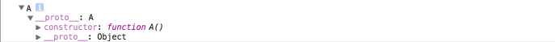
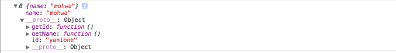
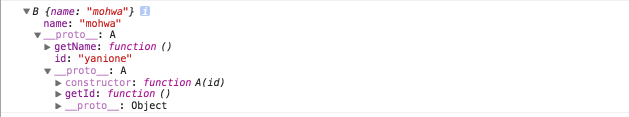
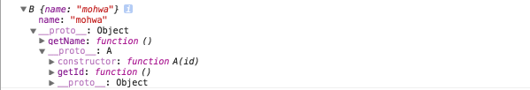
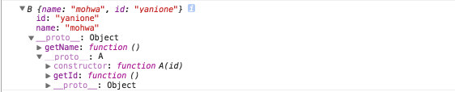

## 1. 글에 대해
 
- 이 글은 (JS 위임 과정의 이해를 돕기 위한 글이 아닌)최근 시작한 [ES567 스터디 그룹](https://www.facebook.com/groups/es567/)의 연구 과제를 위해 작성된 글이다.

  - *그 이해를 돕기위한 내용은 이 [글](http://mohwa.github.io/blog/javascript/2015/10/16/prototype/)을 참고할 수 있다.*<p>
  
- 즉 글 전반적으로 [서술](http://krdic.naver.com/detail.nhn?docid=20817000)된 글이 아닌, 테스트 코드와 그에 대한 주석을 통해 설명하고있다.

## 2. 위임(과정) 이란?

- 결국 객체들간의 <span style="color:#c11f1f">원형 복제 과정</span>을 말한다.(이 말을 잘 기억해두길 바란다)

  - ### (생성자)<span style="color:#c11f1f">함수</span> (객체)를 통한 위임 과정
  
    ```javascript
    // global execution context
    
    // A 함수 객체를 선언한다.
    function A(){
    
        // function execution context
    
    }
    
    // A 함수 객체의 prototype 프로퍼티로 포함된 원형 객체(이후 newAObject 객체로 위임될 객체이기도 하다)
    console.log(A.prototype);
    
    // new 연산자와 A (생성자)함수 (객체)를 통해 새로운 객체가 생성된다.
    var newAObject = new A;
    
    // newAObject 객체의 __proto__ (내부)속성은, A.prototype (원형)객체를 참조하고있다.
    console.log(newAObject.__proto__ === A.prototype); // true
    
    // newAObject 객체의 (생성자)함수인 A 함수 (객체)를 반환한다.
    console.log(newAObject.constructor); // A function object
    console.log(newAObject.constructor === A.prototype.constructor); // true
    
    // newAObject 객체의 prototype chain 에는 A.prototype 객체가 존재하므로 아래 코드를 통해 true 를 반환하게 된다.
    
    // instanceof 연산자는 왼쪽 파라메터로 전달된 객체(newAObject)의 prototype chain 내부에, 오른쪽 파라메터로 전달된 함수 객체(A)의 prototype 프로퍼티가 존재한다면 true 를 반환하게된다.
    console.log(newAObject instanceof A); // true
    
    console.dir(newAObject);
    ```
    
    
                
    - 정리
    
      - 선언된 A 함수 객체는 <span style="color:#c11f1f">prototype</span> 이라는 (원형)<span style="color:#c11f1f">객체</span>를 가지고 있다.<p>
      
      - <span style="color:#c11f1f">new</span> 연산자를 통해 객체 생성시, A.prototype 객체는 newAObject 객체의 \_\_proto\_\_ (내부)속성으로 <span style="color:#c11f1f">위임</span>된다.<p>
      
      - 예상했던 결과와 같이, newAObject.constructor 속성은 (생성자)함수인 A 함수 객체를 참조하고 있다.<p>
      
    [instanceof 연산자](https://developer.mozilla.org/en-US/docs/Web/JavaScript/Reference/Operators/instanceof)
        
  - ### <span style="color:#c11f1f">객체</span>(Object)를 통한 위임 과정
  
    ```javascript
    // A 객체를 생성한다.
    var A = {
        id: '',
        getId: function(){
            return this.id;
        },
        setId: function(id){
            this.id = id;
        }
    };
    
    // A.id 값을 초기화한다.
    A.setId('yanione');
    
    // B 함수 객체를 선언한다.
    function B(name){
    
        name = name || '';
    
        this.name = name;
    }
    
    // B.prototype 객체 프로퍼티에 getName 메서드를 할당한다.
    B.prototype.getName = function(){
        return this.name;
    };
    
    // B.prototype 객체가 가진 맴버들을, 위임할 객체(_A Object)에 추가하기위해, (임시)변수에 저장해둔다.
    var __prototype__ = B.prototype;
    
    // 위임할 A 객체를 복제한다.
    var _A = {
        id: A.id,
        getId: A.getId
    };
    
    // 복제된 _A 객체를 B.prototype 객체 프로퍼티로 위임한다.
    B.prototype = _A;
    
    // __prototype__ 변수에 저장된 객체 맴버를, B.prototype 객체로 재 할당한다.
    B.prototype.getName = __prototype__.getName;
    
    //B.prototype.constructor = B;
    
    // newBObject 객체를 생성한다.
    var newBObject = new B('mohwa');
    
    // newBObject.__proto__ 속성은 B.prototype 객체를 참조하고 있다.
    console.log(newBObject.__proto__ === B.prototype); // true
    
    // B.prototype 객체 프로퍼티는 복제된 _A 객체를 참조하고 있다.
    console.log(newBObject.__proto__ === _A); // true
    
    console.log(newBObject.getId()); // yanione
    console.log(newBObject.getName()); // mohwa
    
    // instanceof 연산자 테스트
    try {
        // instanceof 연산자의 오른쪽 파라메터에는 반드시 함수 객체가 위치해야한다.
        console.log(newBObject instanceof _A); // error
    }
    catch(e){
        // 에러가 발생한다.
        console.log(e.message); // Expecting a function in instanceof check, but got #<Object>
    }
    
    // newBObject 객체의 prototype chain 에는 B.prototype 객체가 존재하므로 아래 코드를 통해 true 를 반환하게 된다.
    console.log(newBObject instanceof B); // true
    
    // _A 객체의 위임 과정으로인해, newBObject.constructor 속성은 Object 함수 객체를 반환하게된다.
    console.log(newBObject.constructor); // Object function object
    ```
    
    
    
    - 정리
    
      - <span style="color:#c11f1f">_A 객체</span>의 <span style="color:#c11f1f">위임</span> 과정으로인해, newBObject.constructor 속성은 (생성자)함수인 B 함수 객체가 아닌, <span style="color:#c11f1f">Object (생성자)함수 객체</span>를 참조하게된다.
    
      - 위 상황을 <span style="color:#c11f1f">우회</span>(명확한 해결책은 아닌)하기 위해, 아래와 같은 코드를 추가할 수 있다.
    
         ```javascript
         // B.prototype 객체에 constructor 속성을 추가시킨다.
         B.prototype.constructor = B;
         ```                
             
  - ### <span style="color:#c11f1f">new</span> 연산자를 통한 위임 과정
  
    ```javascript
    // A 함수 객체를 선언한다.
    function A(id){
    
        id = id || '';
    
        this.id = id;
    }
    
    A.prototype.getId = function(){
        return this.id;
    };
    
    
    // B 함수 객체를 선언한다.
    function B(name){
    
        name = name || '';
    
        this.name = name;
    }
    
    B.prototype.getName = function(){
        return this.name;
    };
    
    var __prototype__ = B.prototype;
    
    var newAObject = new A('yanione');
    
    // newAObject 객체를 B.prototype 객체 프로퍼티에 할당한다.
    B.prototype = newAObject;
    
    //B.prototype.constructor = B;
    
    B.prototype.getName = __prototype__.getName;
    
    var newBObject = new B('mohwa');
    
    // newBObject.__proto__.__proto__ 속성은 A.prototype 객체를 참조하고있다.
    console.log(newBObject.__proto__.__proto__ === A.prototype); // true
    
    // 즉 newBObject.__proto__.__proto__(A.prototype) 속성은 newAObject.__proto__(A.prototype) 속성과 동일하다.
    console.log(newBObject.__proto__.__proto__ === newAObject.__proto__); // true
    
    console.log(newBObject.getId()); // ''
    console.log(newBObject.getName()); // mohwa
    
    // newBObject 객체의 prototype chain 에는 B.prototype 객체가 존재하므로 true 를 반환하게된다.
    
    // newBObject.__proto__ === B.prototype
    console.log(newBObject instanceof B); // true
    
    
    // newBObject 객체의 prototype chain 에는 A.prototype 객체도 존재하므로 true 를 반환하게된다.
    
    // newBObject.__proto__.__proto__ === A.prototype
    console.log(newBObject instanceof A); // true
    
    // new A 객체의 위임 과정으로인해 newBObject.constructor 속성은 A 함수 객체를 참조하게된다.
    console.log(newBObject.constructor); // A function object
    
    console.log(newBObject);
    ```
    
    
    
    - 정리
    
      - newBObject 객체 prototype chain 에는 <span style="color:#c11f1f">A.prototype 객체</span>와 <span style="color:#c11f1f">B.prototype 객체</span> 프로퍼티가 모두 존재하며, <span style="color:#c11f1f">instanceof 연산자</span>를 통해 모두 <span style="color:#c11f1f">true</span> 를 반환하게된다.<p>
    
      - <span style="color:#c11f1f">new A</span> 객체의 <span style="color:#c11f1f">위임</span> 과정으로인해, newBObject.constructor 속성은 B (생성자)함수 객체가 아닌, <span style="color:#c11f1f">A 함수</span> 객체를 참조하게된다.
                                              
  - ### <span style="color:#c11f1f">Object.create</span> 메서드를 통한 위임 과정
  
    ```javascript
    // A 함수 객체를 선언한다.
    function A(id){
    
        id = id || '';
    
        this.id = id;
    }
    
    A.prototype.getId = function(){
        return this.id;
    };
    
    
    // B 함수 객체를 선언한다.
    function B(name){
    
        name = name || '';
    
        this.name = name;
    }
    
    B.prototype.getName = function(){
        return this.name;
    };
    
    var __prototype__ = B.prototype;
    
    // Object.create 메서드를 통해 A.prototype 객체가 위임된, 새로운 객체가 생성된다.
    /*
    
        {
           __proto__: A.prototype
        }
    */
    var newObject = Object.create(A.prototype);
    
    // B.prototype 객체에 Object.create 메서드를 통해 생성된 객체를 할당한다.
    B.prototype = newObject;
    
    //B.prototype.constructor = B;
    
    B.prototype.getName = __prototype__.getName;
    
    var newBObject = new B('mohwa');
    
    console.log(newBObject.getId()); // undefined
    console.log(newBObject.getName()); // mohwa
    
    // Object.create 메서드를 통한 위임 과정으로인해, newBObject.constructor 속성은 A 함수 객체를 참조하게된다.
    console.log(newBObject.constructor); // A function object
    
    console.log(newBObject);
    ```
    
    
    
    - 정리
    
      - <span style="color:#c11f1f">Object.create</span> 메서드를 통해 <span style="color:#c11f1f">new</span> 연산자를 통해서만 가능했던 <span style="color:#c11f1f">위임</span> 과정을 구현했다.<p>
      
      - <span style="color:#c11f1f">Object.create</span> 메서드를 통한 위임 과정으로인해, newBObject.constructor 속성은 B (생성자)함수 객체가 아닌, <span style="color:#c11f1f">A 함수</span> 객체를 참조하게된다.<p>
                                                                       
      - <span style="color:#c11f1f">Object.create</span> 메서드를 통한 위임 과정으로인해, 인스턴스 맴버인 <span style="color:#c11f1f">id</span> 속성을 초기화하지 못했다.(<em>반드시 <span style="color:#c11f1f">new</span> 연산자를 통해서만 인스턴스 맴버를 초기화할 수 있다</em>)
                  
  - ### (인스턴스 맴버를 초기화하는)<span style="color:#c11f1f">Object.create</span> 메서드를 통한 위임 과정
  
    ```javascript
    // A 함수 객체를 선언한다.
    function A(id){
    
        id = id || '';
    
        this.id = id;
    }
    
    A.prototype.getId = function(){
        return this.id;
    };
    
    
    // B 함수 객체를 선언한다.
    function B(id, name){
    
        id = id || '';
        name = name || '';
    
        this.name = name;
    
        // call 메서드를 통해 A (생성자)함수 객체가 가진 인스턴스 맴버를 초기화한다.
        A.call(this, id);
    }
    
    B.prototype.getName = function(){
        return this.name;
    };
    
    var __prototype__ = B.prototype;
    
    var newObject = Object.create(A.prototype);
    
    // B.prototype 객체에 Object.create 메서드를 통해 생성된 객체를 할당한다.
    B.prototype = newObject;
    
    //B.prototype.constructor = B;
    
    B.prototype.getName = __prototype__.getName;
    
    var newBObject = new B('yanione', 'mohwa');
    
    console.log(newBObject.getId()); // yanione
    console.log(newBObject.getName()); // mohwa
    
    console.log(newBObject);
    ```
    
    
    
    - 정리
    
      - <span style="color:#c11f1f">call</span> 메서드를 통해 <span style="color:#c11f1f">B</span> (생성자)함수 객체 호출 시 생성된 <span style="color:#c11f1f">인스턴스 맴버</span>로, <span style="color:#c11f1f">A</span> (생성자) 함수 객체의 <span style="color:#c11f1f">인스턴스 맴버</span>인 <span style="color:#c11f1f">id</span> 속성이 초기화되었다.<p>                                               

## 관련 URL

- [(객체지향) 비슷한것 같으면서도 다른 Attribute와 Property의 차이점](http://ddoong2.com/314)

- [[속깊은 자바스크립트 강좌] 상속, new와 Object.create의 차이](http://unikys.tistory.com/320)


