## 1. 글에 대해

- 이 글은 [Hika Maeng 님](https://www.facebook.com/hika00?fref=nf)이 추천해주신 [ECMAScript 6 길들이기](http://www.yes24.com/24/goods/23904865)라는 책과 개인적인 테스트를 통해 작성되었습니다.

- 또한 모든 결과는 **Chrome 브라우저**를 통해 테스트된 결과입니다.

## 2. 클래스 선언 및 표현식

- ### ES6 클래스는 ES5 가 가진 <span style="color:#c11f1f">[객체 지향 모델](http://mohwa.github.io/blog/javascript/2016/02/05/proto/)</span>을 좀더 <span style="color:#c11f1f">명시적</span>으로 다룰수 있도록 개선된 새로운 모델이다.<br>
    
- ### 클래스 선언식

  ```javascript
  // 클래스 선언
  class A {
      constructor(id){
  
          console.log(arguments); // ['yanione']
  
          try{
              console.log(arguments.callee);
          }
          catch(e){
  
              // ES6 클래스 body 는 기본적으로 strict mode 위에서 동작한다.
  
              // 'caller', 'callee', and 'arguments' properties may not be accessed on strict mode functions
              // or the arguments objects for calls to them
              console.log(e.message);
          }
  
          this.id = id;
      }
  
      // 프로토타입 맴버 선언
      getId(){
          return this.id;
      }
  }
  
  // 선언된 클래스는 기존 함수 객체와 거의 유사한 구조를 가지고 있다.
  console.dir(A);
  
  // 선언된 클래스는 function 데이터 타입을 반환한다.
  console.log(typeof A); // function
  
  // 선언된 클래스의 constructor 속성은 Function (생성자)함수 객체를 반환한다.
  console.dir(A.constructor); // Function function object
  
  // 선언된 클래스가 가진 원형 객체
  console.log(A.prototype);
  
  // 선언된 클래스의 prototype 객체 프로퍼티는 getId 맴버를 포함하고 있다.
  console.log(A.prototype.getId); // getId function object
  
  // newAObject 객체를 생성한다.
  var newAObject = new A('yanione');
  
  // newAObject 객체의 __proto__ (내부)속성은, A.prototype (원형)객체를 참조하고있다.
  console.log(newAObject.__proto__ === A.prototype); // true
  
  // newAObject 객체의 prototype chain 에는 A.prototype 객체가 존재하므로 아래 코드를 통해 true 를 반환하게 된다.
  console.log(newAObject instanceof A); // true
  
  // newAObject 객체의 (생성자)함수(클래스)인 A 함수(클래스) 객체를 반환한다.
  console.log(newAObject.constructor); // A class
  console.log(typeof newAObject.constructor); // function
  
  console.log(newAObject.getId()); // yanione
  
  // newAObject 객체는, ES5 의 (생성자)함수 객체를 통해 생성된 객체와 동일한 구조를 가지고있다.
  console.dir(newAObject);
  ```
      
  선언된 클래스 내부
  
  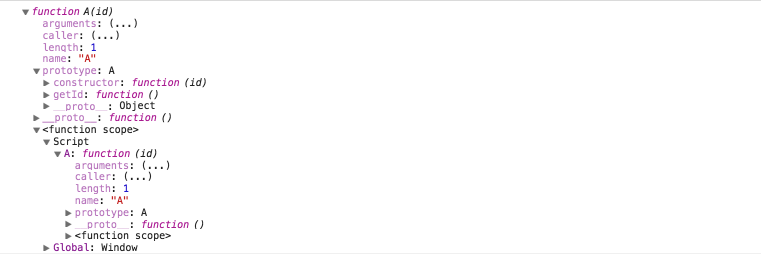
  
  newAObject 객체 내부
  
  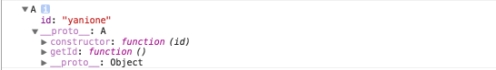
  
  <h2>정리</h2>
  
  - <span style="color:#c11f1f">A</span> 클래스는 기존 <span style="color:#c11f1f">함수</span> 객체와 거의 <span style="color:#c11f1f">유사한 구조</span>를 가지고 있다.<p>
  
  - <span style="color:#c11f1f">A</span> 클래스는 <span style="color:#c11f1f">function</span> 데이터 타입을 <span style="color:#c11f1f">반환</span>한다.<p>
  
  - <span style="color:#c11f1f">A</span> 클래스의 prototype 객체 프로퍼티는 선언된 <span style="color:#c11f1f">프로토타입 맴버</span>인 getId 메서드를 포함하고 있다.<p>
  
  - newAObject.constructor 속성은 (생성자)함수인 <span style="color:#c11f1f">A</span> 함수(클래스) 객체를 참조하고 있다.<p>
  
  - newAObject 객체는, ES5 의 (생성자)<span style="color:#c11f1f">함수</span> 객체를 통해 생성된 객체와 <span style="color:#c11f1f">동일한 구조</span>를 가지고있다.<br><br><br><br>

- ### 그밖의 테스트

  - 클래스 <span style="color:#c11f1f">선언식</span>은 <span style="color:#c11f1f">EC 진입</span> 및 <span style="color:#c11f1f">실행 코드 처리</span> 후에도 <span style="color:#c11f1f">VO</span> 의 새로운 속성으로 추가되지않는다.
  
      ```javascript
      // ec 진입 시 VO 의 새로운 속성으로 추가되지않는다.
      try {
          console.log(A);
      }
      catch(e){
          console.log(e.message); // A is not defined
      }

      // 클래스 선언식
      class A {
          ...
      }

      // 실행 코드 처리후에도 VO 의 새로운 속성으로 추가되지않는다.
      console.log(window.A); // undefined
      ```
          
  - 일반적인 <span style="color:#c11f1f">함수 호출</span>의 경우 아래와 같은 <span style="color:#c11f1f">예외</span>가 발생하게된다.
  
      ```javascript
      // 클래스 선언
      class A {
          constructor(){
              console.dir(this);
          }
      }

      // 일반적인 함수 호출의 경우 아래와 같은 예외가 발생하게된다.

      try {
          A();
      }
      catch(e){
          // Class constructors cannot be invoked without 'new'
          console.log(e.message);
      }


      // call, apply, bind 메서드를 통해 호출한 경우에도 동일한 에러가 발생하게된다.
      try {
          A.call({});
      }
      catch(e){
          // Class constructors cannot be invoked without 'new'
          console.log(e.message);
      }

      try {
          A.apply({});
      }
      catch(e){
          // Class constructors cannot be invoked without 'new'
          console.log(e.message);
      }

      try {
          var _A = A.bind({});
          _A();
      }
      catch(e){
          // Class constructors cannot be invoked without 'new'
          console.log(e.message);
      }

      ```
          
  - <span style="color:#c11f1f">ES5</span> 에서 <span style="color:#c11f1f">ES6</span> 클래스와 같이, 일반적인 <span style="color:#c11f1f">함수 호출</span>을 **막는 방법**은 아래와 같다.
  
      ```javascript
      function A(id, name){

          // this 값 내부 prototype chain 에 A.prototype 이 존재하지 않는 경우
          if (!(this instanceof arguments.callee)){
              throw new Error('Uncaught TypeError: Class constructors cannot be invoked without \'new\'');
          }

          // 인스턴스 맴버를 정의한다.
          this.id = id;
          this.name = name;

          return this;
      }

      // 일반적인 함수 호출의 경우, 초기화된 this 값(global Object) 내부 prototype chain 에는 A.prototype 이 존재하지 않는다.(즉 예외가 발생하게된다)
      A(); // Uncaught TypeError: Class constructors cannot be invoked without new\


      // 하지만 call(or apply, bind) 메서드를 통해, A.prototype 이 포함한 객체를 전달할 경우, (new 연산자가 생략된)일반적인 함수 호출을 막을수는 없다.
      console.log(A.call(Object.create(A.prototype, {age: {value: 18}}), 'yanione', 'mohwa')); // Object {id: "yanione", name: "mohwa", age: 18}

      ```
          
  - 선언된 클래스와 동일한 **식별자 이름**으로 선언 시 아래와 같은 에러가 발생한다.
  
      ```javascript

      // 클래스 선언식
      class A {
          ...
      }

      // 선언된 클래스와 동일한 식별자 이름으로 선언 시 아래와 같은 에러가 발생한다.

      // Uncaught SyntaxError: Identifier 'A' has already been declared
      // var A;

      ```
                      
- ### 클래스 표현식

  ```javascript
  // 클래스 표현식
  var A = class A{
      constructor(id){
  
          console.log(arguments); // ['yanione']
  
          try{
              console.log(arguments.callee);
          }
          catch(e){
  
              // ES6 클래스는 기본적으로 strict mode 위에서 동작한다.
  
              // 'caller', 'callee', and 'arguments' properties may not be accessed on strict mode functions
              // or the arguments objects for calls to them
              console.log(e.message);
          }
  
          this.id = id;
      }
  
      // 프로토타입 맴버 선언
      getId(){
          return this.id;
      }
  }
  
  // 표현식에서 클래스명은 생략 가능하다.
  var _A = class{
      constructor(id){
  
          console.log(arguments); // ['yanione']
  
          try{
              console.log(arguments.callee);
          }
          catch(e){
  
              // ES6 클래스는 기본적으로 strict mode 위에서 동작한다.
  
              // 'caller', 'callee', and 'arguments' properties may not be accessed on strict mode functions
              // or the arguments objects for calls to them
              console.log(e.message);
          }
  
          this.id = id;
      }
  
      // 프로토타입 맴버 선언
      getId(){
          return this.id;
      }
  }     

  // 선언된 클래스는 기존 함수 객체와 거의 유사한 구조를 가지고 있다.
  console.dir(A);
  
  // 일반적인 함수 호출의 경우 함수 선언식과 동일한 예외가 발생하게된다.
  try {
      A();
  }
  catch(e){
      // Class constructors cannot be invoked without 'new'
      console.log(e.message);
  }
  
  var newAObject = new A('yanione');
  console.dir(newAObject);
  
  var new_AObject = new _A('yanione');
  console.dir(new_AObject);
  ```
      
  선언된 클래스 내부(<em>이전 <span style="color:#c11f1f">클래스 선언식</span>과 달리 \<function scope\> 내부에 <span style="color:#c11f1f">Script 속성</span>이 포함되지 않았다</em>)
  
  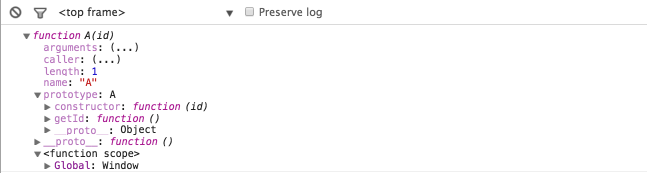
        
  (기명) 클래스 표현식 결과
  
  ```javascript
  var newAObject = new A('yanione');
  console.dir(newAObject);
  ```
  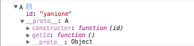
  
  (익명) 클래스 표현식 결과
  
  ```javascript
  var new_AObject = new _A('yanione');
  console.dir(new_AObject);
  ```      
  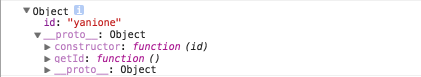
  
  <h2>정리</h2>
  
  - 클래스 표현식은 클래스명에 대한 <span style="color:#c11f1f">기명</span> / <span style="color:#c11f1f">익명</span> 표현이 가능하다.<br><br><br><br>     
      
- ### 그밖의 테스트

  - 클래스 <span style="color:#c11f1f">표현식</span>은 <span style="color:#c11f1f">EC 진입</span> 시 <span style="color:#c11f1f">VO</span> 의 새로운 속성으로 추가되지않는다.
  
      ```javascript
      // ec 진입 시 VO 의 새로운 속성으로 추가되지않는다.
      try {
        console.log(A);
      }
      catch(e){
        console.log(e.message); // A is not defined
      }


      // 표현식에서 클래스명은 생략 가능하다.
      var _A = class A{
        ...
      }

      // 실행 코드 처리 후
      console.dir(window.A); // undefined

      // 선언된 _A 변수에 할당된다.
      console.log(window._A); // A class
      ```

  - 선언된 클래스를 (<span style="color:#c11f1f">new</span> 연산자를 생략 후)<span style="color:#c11f1f"> 호출</span> 하면 에러가 발생한다.
  
      ```javascript
      try{
          // 함수 호출
          A();
      }
      catch(e){
          // Class constructors cannot be invoked without 'new'
          console.log(e.message);
      }

      ```
      
## 3. 접근자 선언

- 접근자 선언

  ```javascript
  // 클래스 선언
  class A {
  
      constructor(id){
          // 접근자 사용을 위해 내부 속성인 __id__ 속성을 선언한다.
          this.__id__ = id;
      }
  
  
      // 접근자 생성 시 A.prototype 객체 내부에는 id 속성과 get/set 접근자 메서드가 생성되어있다.
      get id(){
          return this.__id__;
      }
  
      set id(value){
          value = value || '';
          this.__id__ = value;
      }
  }
  
  console.dir(A); // A class
  
  var newAObject = new A('yanione');
  
  console.dir(newAObject);
  
  // get
  console.log(newAObject.id); // yanione
  
  // set
  newAObject.id = 'yanione2';
  
  console.log(newAObject.id); // yanione2
  
  ```

  접근자 생성시 A.prototype 객체 내부에는 <span style="color:#c11f1f">id</span> 속성과 get/set <span style="color:#c11f1f">접근자</span> 메서드가 생성되어있다.
  
  ```javascript
  console.dir(A);
  ```
  
  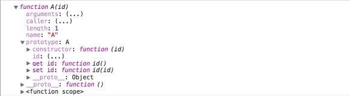
  
  newAObject 객체 내부(newAObject 객체의 <span style="color:#c11f1f">인스턴스 맴버</span>로 <span style="color:#c11f1f">id</span> 속성이 추가된것을 볼 수 있다)     
  
  ```javascript
  var newAObject = new A('yanione');
  console.dir(newAObject);
  ```
  
  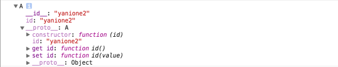

- ES5 <span style="color:#c11f1f">인스턴스 맴버</span>를 통한 <span style="color:#c11f1f">접근자</span> 선언

  ```javascript
  function A(__id__) {
              
      // 객체(this) prototype chain 에 A.prototype 이 존재하는지 않는 경우         
      if (!(this instanceof A)) return;
  
      var id = __id__;
  
      // ES5 에서는 오직 Object.defineProperty 메서드를 통해서만 접근자를 생성할 수 있다.
      Object.defineProperty(this, 'id', {
          get: function() {
              return id;
          },
          set: function(value) {
              id = value;
          }
      });
  }
  
  var new_AObject = new A('yanione');
  
  console.log(new_AObject);
  
  console.log(new_AObject.id); // yanione
  
  new_AObject.id = 'yanione2';
  console.log(new_AObject.id); // yanione2
 
  ```
  
  newAObject 객체 내부(이 경우 선언된 **접근자 프로퍼티**에 대한, 모든 <span style="color:#c11f1f">접근자</span> 메서드들이 <span style="color:#c11f1f">인스턴스 맴버</span>로 포함되는 <span style="color:#c11f1f">단점</span>(메모리)이 존재한다)
       
  - 즉 <span style="color:#c11f1f">new</span> 연산자를 통해 생성되는, 모든 객체에 선언된 모든 <span style="color:#c11f1f">접근자</span> 메서드가 생성되며, 그로인해 메모리가 낭비되는 <span style="color:#c11f1f">단점</span>이 존재한다.
  
      ```javascript
      // new 연산자를 통해 생성되는 모든 객체(인스턴스)에 선언된, 접근자 메서드가 생성되며, 그로인해 메모리가 낭비되는 단점이 존재한다.
      var newAObject = new A('yanione');
      console.dir(newAObject);
      
      var newAObject2 = new A('yanione');
      console.dir(newAObject2);
     
      ```
      
      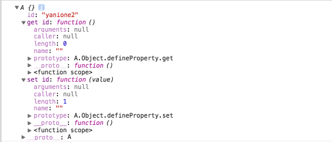<br><br><br><br>
               
                    
- ES5 <span style="color:#c11f1f">프로토타입 맴버</span>를 통한 <span style="color:#c11f1f">접근자</span> 선언

  ```javascript
  // A 함수 객체를 선언한다.
  function A() {
      if (!(this instanceof A)) return;
  }
  
  // A.prototype 객체에 id 속성에 대한 get/set 접근자 메서드를 생성한다.
  Object.defineProperty(A.prototype, 'id',{
      get: function(){
          // 내부 속성인 __id__ 속성을 통해 접근자에 접근한다.
          return this.__id__
      },
      set: function(value){
          this.__id__ = value;
      }
  });
  
  
  var newAObject = new A();
  
  console.dir(newAObject);
  
  newAObject.id = 'yanione';
  console.log(newAObject.id); // yanione
 
  ```
                              
  Object.defineProperty 메서드를 통한, 접근자 생성시 A.prototype 객체 내부에는 <span style="color:#c11f1f">id</span> 속성과 get/set <span style="color:#c11f1f">접근자</span> 메서드가 생성되어있다.
  
  ```javascript
  console.dir(A);
  ```
  
  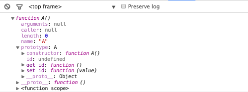
                                    
  newAObject 객체 내부(이 경우 ES6 에서의 <span style="color:#c11f1f">접근자 생성</span>과 같이, 선언된 모든 <span style="color:#c11f1f">접근자 메서드</span>들이 A.prototype 객체에 <span style="color:#c11f1f">할당</span>되며, 이전에 가졌던 (메모리 낭비에 대한)<span style="color:#c11f1f">단점</span>을 피할 수 있다)
  
  ```javascript
  
  var newAObject = new A();
  console.dir(newAObject);
  ```
  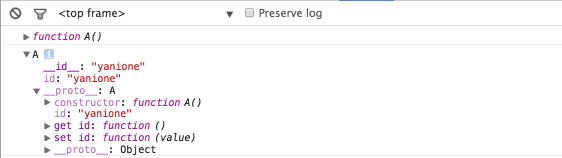        

## 4. 정적 메서드 선언

- 정적 메서드 선언

  ```javascript
  // 클래스 선언
  class A {
  
      constructor(){
      }
  
      // 정적 메서드 선언
      static post(url){
          this.url = url;
      }
  }
  
  console.dir(A);
  
  // A.post 메서드는 function 데이터 타입을 반환한다.
  console.log(typeof A.post); // function
  
  // 선언된 정적 메서드는 해당 클래스의 새로운 속성으로 할당된다.
  console.dir(A.post); // post function object
  
  // A.post.constructor 속성은 Function (생성자)함수 객체를 참조하고있다.
  console.log(A.post.constructor); // Function function object
  
  // A.post 정적 메서드는 prototype 객체 프로퍼티를 갖지않는다.
  console.log(A.post.prototype); // undefined
  
  // (생성자)함수 객체로 호출 시 아래와 같은 에러가 발생한다.
  try {
      console.log(new A.post('http://mohwa.com'));
  }
  catch(e){
      /*
       Uncaught TypeError: post(url){
       this.url = url;
       } is not a constructor
      */
      console.log(e.message);
  }
  ```
  
  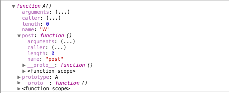                  
              

- ES5 를 통한 정적 메서드 선언

  ```javascript
  function A(id) {
  }
  
  A.post = function(){
  };
  
  console.dir(A); // A function object
  
  console.log(A.post); // post function object
  
  // (생성자)함수 객체로 호출 시 새로운 객체가 생성된다.
  var newAPostObject = new A.post('http://mohwa.com');
  console.dir(newAPostObject);
  
  ```
  
  A 함수 객체 내부
  
  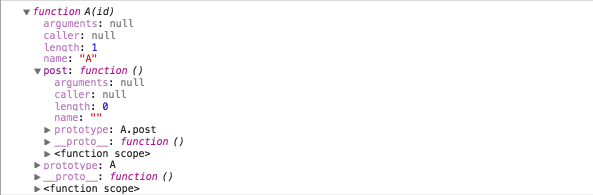<p>
  
  newAPostObject 객체 내부
  
  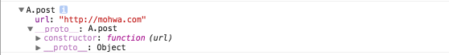
      
      
## 5. 제네레이트 메서드 선언

- 제네레이트 메서드 선언

  ```javascript
  // 클래스 선언
  class A {
  
      constructor(){
      }
  
      // 제네레이터 메서드 선언
      * post(){
          yield 1;
          yield 2;
          yield 3;
      }
  }
  
  console.dir(A);
  
  // 선언된 제네레이터 메서드는 A 클래스의 prototype 객체 프로퍼티에 할당된다.
  console.dir(A.prototype.post); // post function object
  
  // 제네레이터 메서드의 (생성자)함수 객체로 GeneratorFunction 함수 객체를 반환한다.
  console.dir(A.prototype.post.constructor); // GeneratorFunction function object 
  
  var newAObject = new A;
  var generator = newAObject.post();
  
  console.dir(newAObject);
  
  console.log(generator.next()); // 1
  console.log(generator.next()); // 2
  console.log(generator.next()); // 3
  console.log(generator.next().done); // true
  ```
  
  <span style="color:#c11f1f">A</span> 클래스 내부(선언된 제네레이터 메서드는 A 클래스의 prototype 객체 프로퍼티에 할당된다)
  
  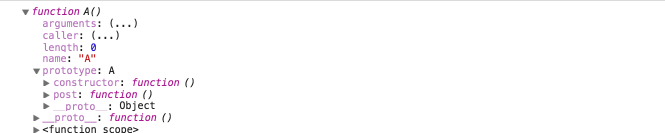<p>
               
  newAObject 객체 내부(제네레이터 메서드의 (생성자)함수 객체로 <span style="color:#c11f1f">GeneratorFunction</span> 함수 객체를 반환한다)
  
  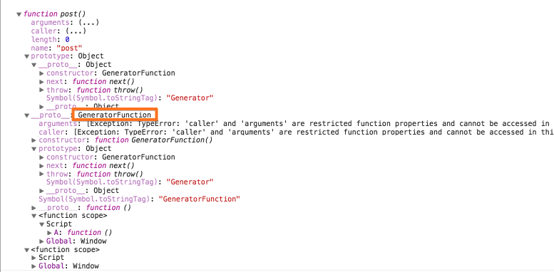<p>                   
                            
## 6. 클래스 상속

- ES6 에서는 <span style="color:#c11f1f">extends</span> 절 및 <span style="color:#c11f1f">super</span> 키워드를 통해 상속을 구현할 수 있다.

  ```javascript
  function A(id){
      // 이 경우 this 는 new C 를 통해 생성된 객체를 가리킨다.
      this.id =  id;
  }
  
  A.prototype.getId = function(){
      return this.id;
  };
  
  // 클래스가 아닌 함수 객체에 대한 상속도 가능하다.
  class B extends A {
  
      constructor(id, name){
  
          // super 키워드를 통해 인스턴스 맴버 초기화 및 위임 과정이 발생한다.
          super(id);

          // 이 경우 this 는 new C 를 통해 생성된 객체를 가리킨다.
          this.name = name;
      }
  
      getName(){
          return this.name;
      }
  }
  
  // 클래스 상속
  class C extends B {
  
      constructor(id, name, age){
  
          // super 키워드를 통해 인스턴스 맴버 초기화 및 위임 과정이 발생한다.
          super(id, name);
  
          // 이 경우 this 는 new C 를 통해 생성된 객체를 가리킨다.
          this.age = age;
      }
  
      getAge(){
          return this.age;
      }
  }
  
  console.log(new C('yanione', 'mohwa', 35));
  ```
      
- <s>**chrome 48 버전**의 결과</s>

  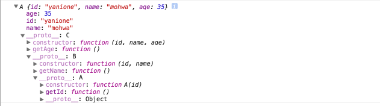
      
      
- **chrome 49 버전**을 통해 다시 확인해본결과, 이전 결과와 달라진것을 볼 수 있다.

    - **인스턴스 이름**이 **A** ==> **C** 로 바뀐것은 맞는듯한데, 그 하위의 **prototype chain 이름**들이 상이?한듯 하다.(즉 **C 인스턴스**의 \_\_proto\_\_ 속성이 **C.prototype** 이 아닌, **B.prototype** 을 참조하고 있다고 출력하고 있다.(하지만 보여지는 **prototype 객체** 내부에는, **C 클래스**의 프로토타입 메서드인 **getAge** 를 포함하고 있는것을 볼 수 있다))
      
      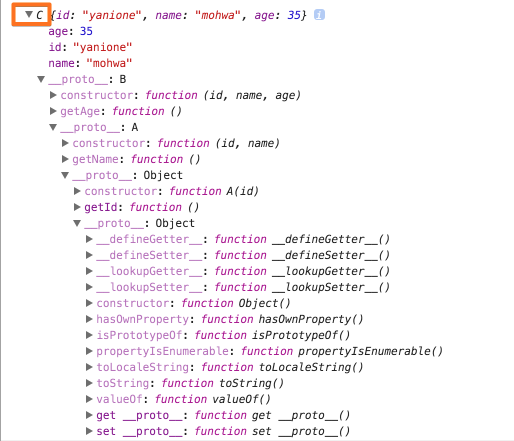                  
              

- <span style="color:#c11f1f">ES5</span> 를 통해 <span style="color:#c11f1f">클래스 상속</span>을 구현해본 예(ES6 에서의 <span style="color:#c11f1f">super</span> 키워드는 아래 <code>this.\_\_proto\_\_.constructor.call</code> 과 같은 일종의 <span style="color:#c11f1f">[매크로](https://ko.wikipedia.org/wiki/%EB%A7%A4%ED%81%AC%EB%A1%9C_(%EC%BB%B4%ED%93%A8%ED%84%B0_%EA%B3%BC%ED%95%99))</span> 구현으로 볼 수 있다)

  ```javascript
  function A(id){
      this.id =  id;
  }
  
  A.prototype.getId = function(){
      return this.id;
  };
  
  
  function B(id, name){
  
      // call 메서드를 통해 A (생성자)함수 객체(this.__proto__.__proto__.__proto__)가 가진 인스턴스 맴버를 초기화한다.
      this.__proto__.__proto__.__proto__.constructor.call(this, id);
  
      this.name =  name;
  }
  
  // B.prototype 객체 프로퍼티에 A.prototype (원형)객체를 포함한 새로운 객체를 할당한다.
  B.prototype = Object.create(A.prototype);
  B.prototype.getName = function(){
      return this.name;
  };
  
  B.prototype.constructor = B;
  
  function C(id, name, age){
  
      id = id || '';
      name = name || '';
      age = age || 0;
  
      // call 메서드를 통해 B (생성자)함수 객체(this.__proto__.__proto__)가 가진 인스턴스 맴버를 초기화한다.
      this.__proto__.__proto__.constructor.call(this, id, name);
  
      this.age = age;
  }
  
  // C.prototype 객체 프로퍼티에 B.prototype (원형)객체를 포함한 새로운 객체를 할당한다.
  C.prototype = Object.create(B.prototype);
  C.prototype.getAge = function(){
      return this.age;
  };
  
  C.prototype.constructor = C;
  
  
  var newCObject = new C('yanione', 'mohwa', 35);
  
  console.log(newCObject.getId()); // yanione
  console.log(newCObject.getName()); // mohwa
  console.log(newCObject.getAge()); // 35
  
  console.log(newCObject);
  ```
      
  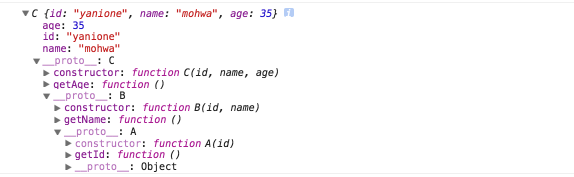
                                                         
- **파생 클래스**의 **constructor**(생성자) 내부에서는 반드시 <span style="color:#c11f1f">super</span> 키워드가 호출되어야한다.

  ```javascript
  function A(id){
  
      this.id =  id;
  }
  
  A.prototype.getId = function(){
    return this.id;
  };
  
  // 클래스가 아닌 함수 객체에 대한 상속도 가능하다.
  class B extends A {
  
      constructor(id, name){
  
          // 파생 클래스의 constructor 내부에서는 super 키워드만을 사용(호출)하거나, this 키워드 사용전에 반드시 호출되어야한다.
          // 즉 constructor 내부에서는 super 키워드가 반드시 호출되어야한다.
      }
  
      getName(){
          return this.name;
      }
  }
  
  try{
      console.log(new B('yanione', 'mohwa'));
  }
  catch(e){
      // 아래와 같은 예외가 발생한다.
      console.log(e.message); // this is not defined
  }
  ```

- <span style="color:#c11f1f">super</span> 키워드가 <span style="color:#c11f1f">this</span> 처리 후에 호출될 경우, 예외가 발생된다.(반드시 <span style="color:#c11f1f">this</span> 사용전에 호출되어야한다)

  ```javascript
  function A(id){
      this.id =  id;
  }
  
  A.prototype.getId = function(){
      return this.id;
  };
  
  // 클래스가 아닌 함수 객체에 대한 상속도 가능하다.
  class B extends A {
  
      constructor(id, name){
  
          // 반드시 this 사용전에 호출되어야한다.
          // super(id);
          
          try{
              this.name = name;
          }
          catch(e){
              // Uncaught ReferenceError: this is not defined
              console.log(e.message);
          }
  
          // 이 경우 super 키워드는 처리되지 않는다.
          super(id);
      }
  
      getName(){
          return this.name;
      }
  }
  
  console.log(new B('yanione', 'mohwa'));
  ``` 
 
- <span style="color:#c11f1f">super</span> 키워드를 통해, **부모 클래스**에 선언된 <span style="color:#c11f1f">static method</span> 에 접근 가능하다.

  ```javascript     
  let A = class A {
  
    constructor() {
    }
    
    static x(){
      console.log('x method');
    }
  }

  let B = class B extends A {
  
    constructor(length) {
    
      // 파생 클래스의 constructor 내부에서는 반드시 super 키워드가 호출되어야한다.
      super();
    }

    static y() {

      // static 메서드 내부 "this" 는 "B class" 와 동일하다.
      console.log(this); // B class


      // "super" 는 "this.__proto__(A class)" 와 동일하다.

      // 즉 this.__proto__.x() 메서드를 통해 호출 가능하다.
      this.__proto__.x(); // x method
      
      // super 를 통한 접근
      super.x(); // x method
    }
  }

  // var _B = new B();
  B.y();
  ``` 
      
- <span style="color:#c11f1f">ES5</span> 를 통해, 위 <span style="color:#c11f1f">super</span> 키워드의 **특성**을 구현해본 예

  ```javascript         
  // A 함수 객체를 생성한다.
  function A(){
  }

  // A 함수 객체의 x static method 를 생성한다.
  A.x = function(){
      console.log('x method');
  };

  // B 함수 객체를 생성한다.
  function B(){
  }

  // B 함수 객체의 y static method 를 생성한다.
  B.y = function(){
      // this(B function object).__proto__(A function object).x 메서드에 접근 가능하다.
      this.__proto__.x(); // === super.x();
  };

  // B 함수 객체의 __proto__ 속성은 A 함수 객체를 참조하고있다.
  B.__proto__ = A;

  B.y(); // x method
  ```  
                     
- <span style="color:#c11f1f">super</span> 키워드를 통해, 부모 클래스에 선언된 <span style="color:#c11f1f">prototype method</span> 에 접근 가능하다.                     
    
    ```javascript        
    let A = class A {
    
        constructor(id) {
          this.id = id;
        }
    
        x(){
          console.log('x method');
        }
    }
    
    let B = class B extends A {
    
        constructor(id, name) {
        
          super(id);
        
          this.name = name;
        }
    
        y() {
        
          // this.__proto__(B.prototype).__proto__(A.prototype).x()
          this.__proto__.__proto__.x(); // x method
        
          // super 키워드는 this.__proto__.__proto__ 와 같다.
          super.x(); // === this.__proto__.__proto__.x() === x method
        }
    }
    
    
    let _B = new B('yanione', 'mohwa');
    
    console.dir(_B); // {id: "yanione", name: "mohwa"}
    
    _B.y();
    ```
    
- <span style="color:#c11f1f">ES5</span> 를 통해, 위 <span style="color:#c11f1f">super</span> 키워드의 **특성**을 구현해본 예

  ```javascript         
  // A 함수 객체를 생성한다.
  function A(id){

      this.id = id;
  }

  // A 함수 객체의 x static method 를 생성한다.
  A.prototype.x = function(){
      console.log('x method');
  };

  // B 함수 객체를 생성한다.
  function B(id, name){

      // this.__proto__.__proto__.constructor(A function object)
      this.__proto__.__proto__.constructor.call(this, id);
      this.name = name;
  }

  // B.prototype 에, A.prototype 을 원형으로 갖는 새로운 객체를 할당한다.
  B.prototype = Object.create(A.prototype);

  // y prototype method 를 생성한다.
  B.prototype.y = function(){

      // this(B instance).__proto__(B.prototype).__proto__(A.prototype).x
      this.__proto__.__proto__.x(); // === super.x 와 같다 === x method
  };

  B.prototype.constructor = B;

  var _B = new B('yanione', 'mohwa');

  console.log(_B); // {id: "yanione", name: "mohwa"}

  _B.y();
  ```      
                                                            
                                                            


