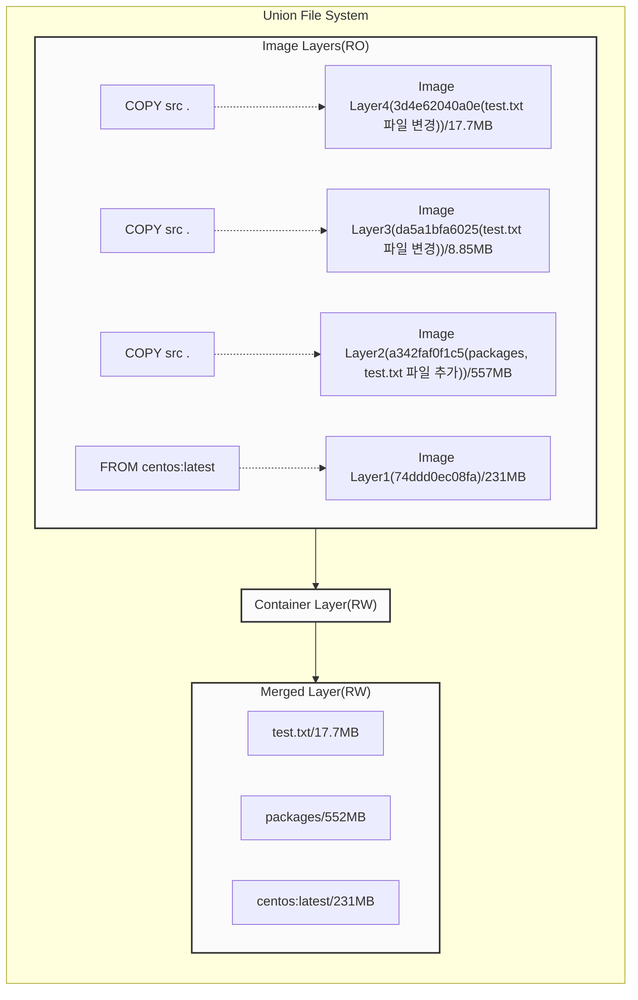
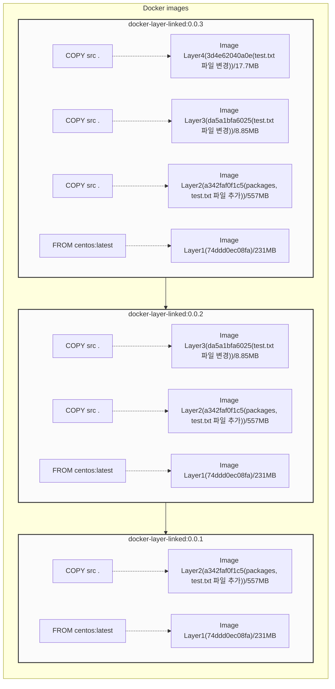
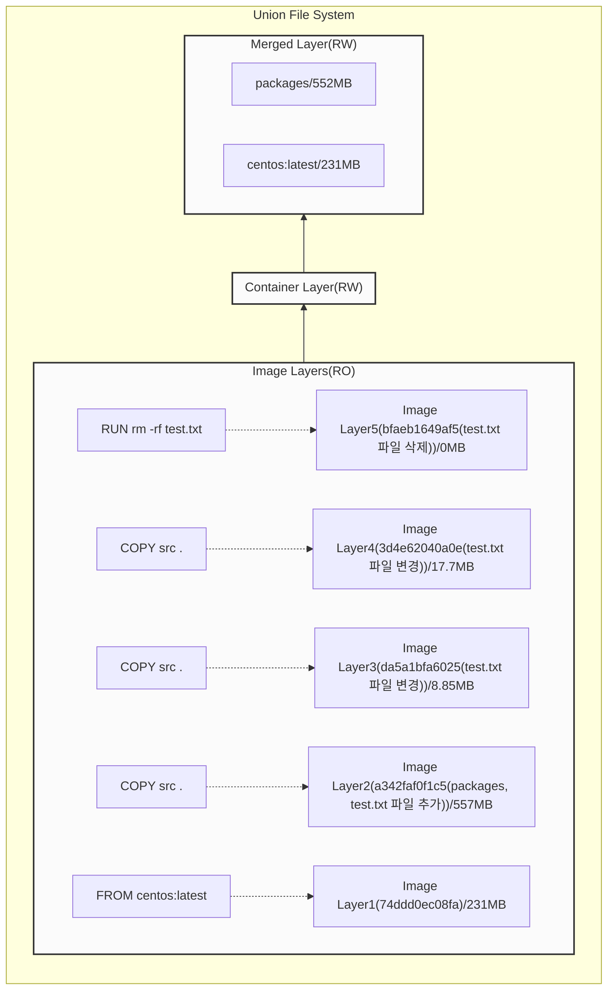
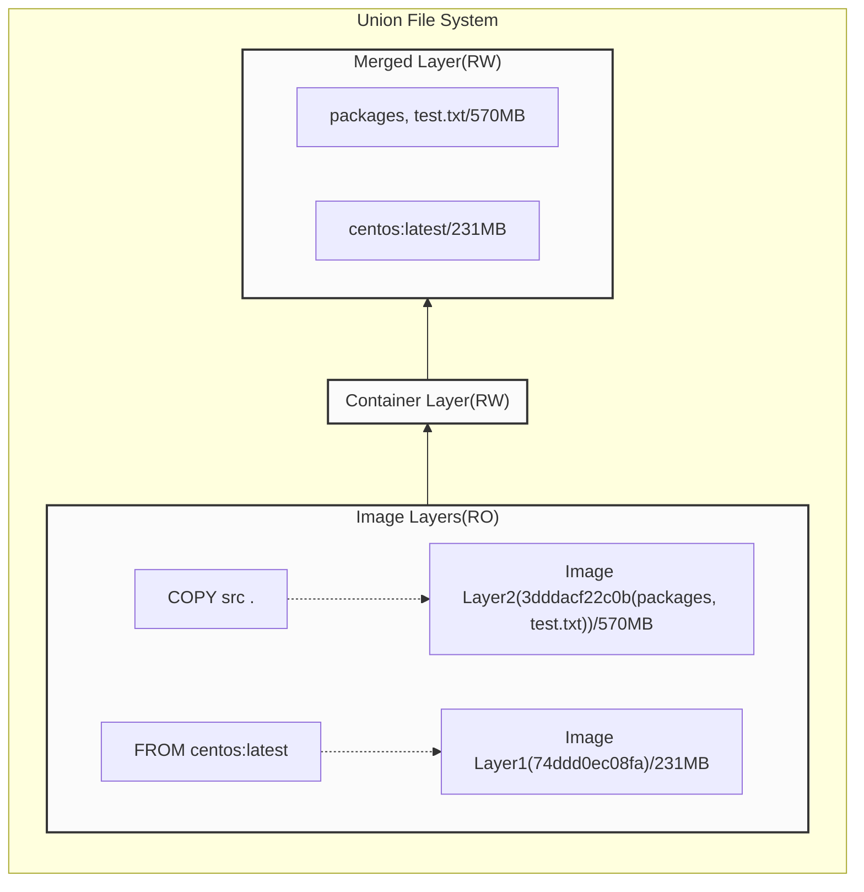
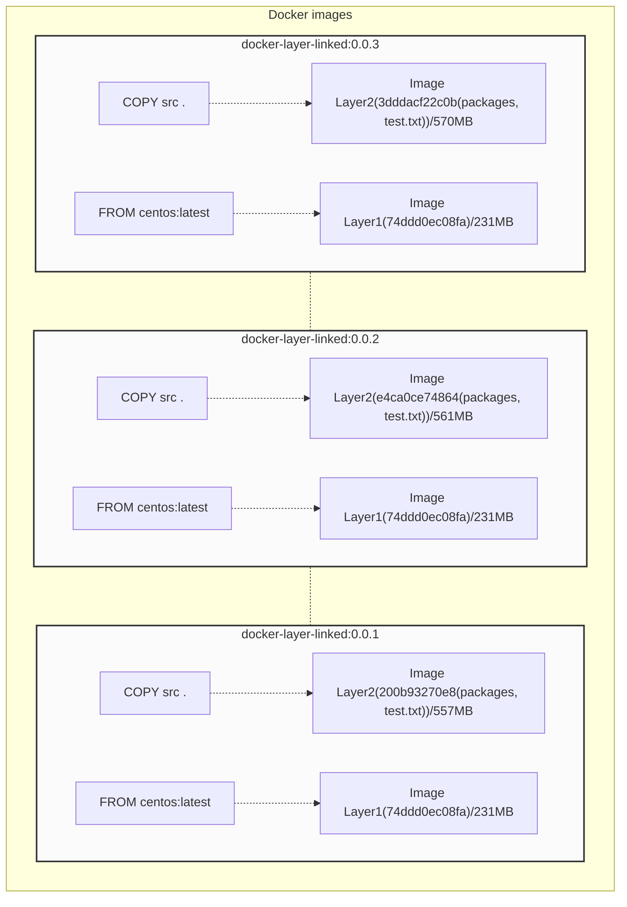
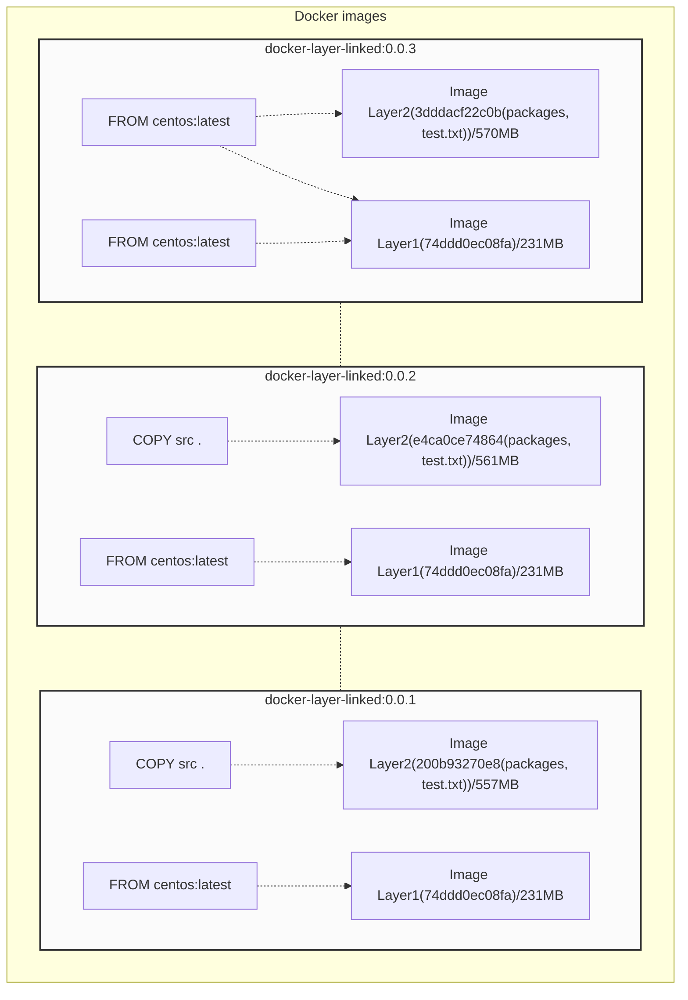

이 글을 더 정확히 이해하기위해, [도커 중간 이미지 및 레이어](/docker-intermediate-image), [도커 빌드 캐시](/docker-build-cache)
를 먼저 읽어보시는것을 추천드립니다.

테스트 환경

- OS: centos/7

- Docker Version: 20.10.12

    > 호스트 OS 및 Docker Version 에 따라, 이 글의 `테스트 결과`가 다를 수 있습니다.

    - [Where is /var/lib/docker on Mac/OS X](https://stackoverflow.com/questions/38532483/where-is-var-lib-docker-on-mac-os-x)
    - [Mac 환경의 Docker 는 /var/lib/docker가 없다](https://memostack.tistory.com/3)

- 도커 `이미지` 및 `컨테이너`가 초기화되어있습니다.

## 테스트 배경

현재 개발중인 `앱`을 `도커 이미지`로 만들어야할 일이 있었는데, `앱`에서 사용되는 `패키지` 용량이 너무 커, 
전체 `다운로드 시간` 및 `용량`을 `최소화`해야하는 이슈가 있었습니다. 초기에는 `기반 OS` 를 Base 로 두는 방식을 생각했지만, 
매 버전마다, 다운받아야하는 `패키지` 용량을 줄일 순 없을까? 고민하다, 버전 별 `꼬리물기` 방식을 테스트해보기로했습니다.

테스트전에는, 대략 이렇게 생각했습니다.

- `꼬리 물기` 방식

```shell
0.0.1 = Base(centos(231MB)) + 패키지(500MB) + 앱 리소스(1MB) = 732MB
# Base(0.0.1) 이미지가 캐시된 경우
0.0.2 = Base(0.0.1) + 앱 리소스(1MB) = 1MB
# Base(0.0.2) 이미지가 캐시된 경우
0.0.3 = Base(0.0.2) + 앱 리소스(1MB) = 1MB
# Base(0.0.3) 이미지가 캐시된 경우
0.0.4 = Base(0.0.3) + 앱 리소스(0MB) = 0MB
```
    
- `기반 Base` 방식

```shell
0.0.1 = Base(centos(231MB)) + 패키지(500MB) + 앱 리소스(1MB) = 732MB
# Base(centos(231MB)) 이미지가 캐시된 경우
0.0.2 = Base(centos(231MB)) + 패키지(500MB) + 앱 리소스(2MB) = 502MB
# Base(centos(231MB)) 이미지가 캐시된 경우
0.0.3 = Base(centos(231MB)) + 패키지(500MB) + 앱 리소스(3MB) = 503MB
# Base(centos(231MB)) 이미지가 캐시된 경우
0.0.4 = Base(centos(231MB)) + 패키지(500MB) + 앱 리소스(0MB) = 500MB
```
             
즉 `캐시`가 있을 경우, `꼬리 물기` 방식이 `기반 Base` 방식에 비해 `적은 용량`을 다운받기때문에, 
컨테이너를 빠르게 실행시킬 수 있을거라 생각했습니다.  
    
> 결론 부터 말씀드리면, <u>버전이 업데이트될때마다</u> 늘어나는 불필요한 `이미지 레이어`때문에,
> `레지스트리`와 `로컬 용량`이 지속적으로 늘어나, `꼬리 물기` 방식은 사용할 수 없었습니다. 

## 꼬리물기 방식

#### `Dockerfile.v1 ~ v3` 파일들을 생성합니다.

Dockerfile.v1 파일을 생성합니다.

```shell
FROM centos:latest
COPY src .
```

Dockerfile.v2 파일을 생성합니다.

```shell
FROM yanione2/docker-layer-linked:0.0.1
COPY src .
```

Dockerfile.v3 파일을 생성합니다.

```shell
FROM yanione2/docker-layer-linked:0.0.2
COPY src .
```

```shell
[root@docker-test src]# ls -al
total 17284
drwxr-xr-x. 3 root root       38 Jan 16 05:59 .
drwxr-xr-x. 3 root root      101 Jan 14 19:42 ..
drwxr-xr-x. 2 root root       25 Jan 16 05:59 packages
-rw-r--r--. 1 root root  4424097 Jan 16 05:39 test.txt
```

`src` 디렉토리는, `packages`(552MB) 디렉토리와 `test.txt`(4.42MB) 파일을 포함하고있습니다.

## docker-layer-linked:0.0.1 ~ 0.0.3 이미지를 빌드합니다.

#### `0.0.1` 이미지를 빌드합니다.

```shell
[root@docker-test docker-layer-linked]# ls
Dockerfile.v1  Dockerfile.v2  Dockerfile.v3  src
[root@docker-test docker-layer-linked]# docker build -f Dockerfile.v1 -t yanione2/docker-layer-linked:0.0.1 .
Sending build context to Docker daemon  556.6MB
Step 1/2 : FROM centos:latest
latest: Pulling from library/centos
a1d0c7532777: Pull complete
Digest: sha256:a27fd8080b517143cbbbab9dfb7c8571c40d67d534bbdee55bd6c473f432b177
Status: Downloaded newer image for centos:latest
 ---> 5d0da3dc9764
Step 2/2 : COPY src .
 ---> f90959d1d8b8
Successfully built f90959d1d8b8
Successfully tagged yanione2/docker-layer-linked:0.0.1
```

#### `0.0.1` 이미지를 `Base` 로 바라보는 `0.0.2` 이미지를 빌드합니다.

- `두 번째 이미지`를 빌드하기전에, `src` 디렉토리의 `packages` 를 삭제하고, `test.txt` 파일을 `수정`합니다.

> 두 번째 이미지부터는 `packages` 업데이트가 없는 것을 전제로 합니다.

```shell
[root@docker-test src]# ls
packages  test.txt
[root@docker-test src]# rm -rf packages
[root@docker-test src]# cp test.txt test1.txt
[root@docker-test src]# cat test1.txt >> test.txt
[root@docker-test src]# rm -rf test1.txt
[root@docker-test src]# ls -al
total 8644
drwxr-xr-x. 2 root root      22 Jan 16 06:30 .
drwxr-xr-x. 3 root root     101 Jan 14 19:42 ..
-rw-r--r--. 1 root root 8848194 Jan 16 06:30 test.txt
```

두 번째 이미지를 `빌드`합니다.

```shell
[root@docker-test docker-layer-linked]# ls
Dockerfile.v1  Dockerfile.v2  Dockerfile.v3  src
[root@docker-test docker-layer-linked]# docker build -f Dockerfile.v2 -t yanione2/docker-layer-linked:0.0.2 .
Sending build context to Docker daemon  8.855MB
Step 1/2 : FROM yanione2/docker-layer-linked:0.0.1
 ---> f90959d1d8b8
Step 2/2 : COPY src .
 ---> fae67305fb24
Successfully built fae67305fb24
Successfully tagged yanione2/docker-layer-linked:0.0.2
```

#### `0.0.2` 이미지를 `Base` 로 바라보는 `0.0.3` 이미지를 빌드합니다.

- `세 번째 이미지`를 빌드하기전에, `src` 디렉토리의 `test.txt` 파일을 한번 더 `수정`합니다.

    ```shell
    [root@docker-test src]# ls
    test.txt
    [root@docker-test src]# cp test.txt test1.txt
    [root@docker-test src]# cat test1.txt >> test.txt
    [root@docker-test src]# rm -rf test1.txt
    [root@docker-test src]# ls -al
    total 33280
    drwxr-xr-x. 2 root root       22 Jan 16 06:31 .
    drwxr-xr-x. 3 root root      101 Jan 14 19:42 ..
    -rw-r--r--. 1 root root 17696388 Jan 16 06:31 test.txt
    ```

세 번째 이미지를 `빌드`합니다.

```shell
[root@docker-test docker-layer-linked]# ls
Dockerfile.v1  Dockerfile.v2  Dockerfile.v3  src
[root@docker-test docker-layer-linked]# docker build -f Dockerfile.v3 -t yanione2/docker-layer-linked:0.0.3 .
Sending build context to Docker daemon   17.7MB
Step 1/2 : FROM yanione2/docker-layer-linked:0.0.2
 ---> fae67305fb24
Step 2/2 : COPY src .
 ---> 7f74b457892b
Successfully built 7f74b457892b
Successfully tagged yanione2/docker-layer-linked:0.0.3
```

## `0.0.1 ~ 0.0.3` 이미지를 레지스트리에 업로드합니다.

```shell
[root@docker-test docker-layer-linked]# docker images
REPOSITORY                     TAG       IMAGE ID       CREATED              SIZE
yanione2/docker-layer-linked   0.0.3     7f74b457892b   19 seconds ago       814MB
yanione2/docker-layer-linked   0.0.2     fae67305fb24   About a minute ago   797MB
yanione2/docker-layer-linked   0.0.1     f90959d1d8b8   2 minutes ago        788MB
centos                         latest    5d0da3dc9764   4 months ago         231MB
[root@docker-test docker-layer-linked]# docker push yanione2/docker-layer-linked:0.0.1
The push refers to repository [docker.io/yanione2/docker-layer-linked]
a342faf0f1c5: Pushed
74ddd0ec08fa: Layer already exists
0.0.1: digest: sha256:c890be6a3bae8438ba2b7352fb6f4218dd1549968f3d4440c681621ce1506628 size: 742
[root@docker-test docker-layer-linked]# docker push yanione2/docker-layer-linked:0.0.2
The push refers to repository [docker.io/yanione2/docker-layer-linked]
da5a1bfa6025: Pushed
a342faf0f1c5: Layer already exists
74ddd0ec08fa: Layer already exists
0.0.2: digest: sha256:e99658278ab6de9b66e3c53a2adae50c07984d53a769e4375aee27abc4343490 size: 953
[root@docker-test docker-layer-linked]# docker push yanione2/docker-layer-linked:0.0.3
The push refers to repository [docker.io/yanione2/docker-layer-linked]
3d4e62040a0e: Pushed
da5a1bfa6025: Layer already exists
a342faf0f1c5: Layer already exists
74ddd0ec08fa: Layer already exists
0.0.3: digest: sha256:2e85737cea40b63683493f1de2546bdde6eef242bd6230ffd2a8eba4003e85a0 size: 1164
```

레지스트리에 등록된 이미지 목록입니다.


## 생성된 `0.0.1 ~ 0.0.3` 이미지를 모두 삭제합니다.

```shell
[root@docker-test docker-layer-linked]# docker images -a
REPOSITORY                     TAG       IMAGE ID       CREATED          SIZE
yanione2/docker-layer-linked   0.0.3     7f74b457892b   18 minutes ago   814MB
yanione2/docker-layer-linked   0.0.2     fae67305fb24   19 minutes ago   797MB
yanione2/docker-layer-linked   0.0.1     f90959d1d8b8   21 minutes ago   788MB
centos                         latest    5d0da3dc9764   4 months ago     231MB
[root@docker-test docker-layer-linked]# docker rmi -f 7f74b457892b fae67305fb24 f90959d1d8b8 5d0da3dc9764
Untagged: yanione2/docker-layer-linked:0.0.3
Untagged: yanione2/docker-layer-linked@sha256:2e85737cea40b63683493f1de2546bdde6eef242bd6230ffd2a8eba4003e85a0
Deleted: sha256:7f74b457892b1ae3c75abc3c8635f3237ab326046904f3bf442807a7d17b4677
Deleted: sha256:e8b05f835c4fbf9327f7f6500934f627ba5ab4bde0cc42a0e1e20dddf6195a21
Untagged: yanione2/docker-layer-linked:0.0.2
Untagged: yanione2/docker-layer-linked@sha256:e99658278ab6de9b66e3c53a2adae50c07984d53a769e4375aee27abc4343490
Deleted: sha256:fae67305fb24c9ada3930e5a6801a3272cba53adf1a20832843ae34b58a5952e
Deleted: sha256:00921148bccaf5d9e534a055b2098928a5469170f67bd8706ad13f5be666649b
Untagged: yanione2/docker-layer-linked:0.0.1
Untagged: yanione2/docker-layer-linked@sha256:c890be6a3bae8438ba2b7352fb6f4218dd1549968f3d4440c681621ce1506628
Deleted: sha256:f90959d1d8b8f1ff676f0b7f08746619ed340542a65d18be59c4e16feb3eee53
Deleted: sha256:fceb36538db671d97b969889514b3afe6c6f7c896002371d6886cb2f46a6f57a
Untagged: centos:latest
Untagged: centos@sha256:a27fd8080b517143cbbbab9dfb7c8571c40d67d534bbdee55bd6c473f432b177
Deleted: sha256:5d0da3dc976460b72c77d94c8a1ad043720b0416bfc16c52c45d4847e53fadb6
Deleted: sha256:74ddd0ec08fa43d09f32636ba91a0a3053b02cb4627c35051aff89f853606b59
[root@docker-test docker-layer-linked]# docker images -a
REPOSITORY   TAG       IMAGE ID   CREATED   SIZE
[root@docker-test docker-layer-linked]#
```

## 마지막으로 업로드된 `0.0.3` 이미지를 가져옵니다.

```shell
[root@docker-test docker-layer-linked]# docker pull yanione2/docker-layer-linked:0.0.3
0.0.3: Pulling from yanione2/docker-layer-linked
a1d0c7532777: Pull complete
9463394a86ae: Pull complete
73ebef1e13ff: Pull complete
677d3285a1be: Pull complete
Digest: sha256:2e85737cea40b63683493f1de2546bdde6eef242bd6230ffd2a8eba4003e85a0
Status: Downloaded newer image for yanione2/docker-layer-linked:0.0.3
docker.io/yanione2/docker-layer-linked:0.0.3
[root@docker-test docker-layer-linked]# docker images
REPOSITORY                     TAG       IMAGE ID       CREATED          SIZE
yanione2/docker-layer-linked   0.0.3     7f74b457892b   21 minutes ago   814MB
``` 

`0.0.3` 이미지에 포함된, 4개의 `이미지 레이어`(a1d0c7532777 ~ 677d3285a1be)를 모두 가져옵니다.

> 모든 이미지는 `컨테이너 파일 시스템`에 영향을 주는, `이미지 레이어`들을 포함하고있습니다.


각 이미지 레이어들의 용량을 `docker history` 에서 확인해보면, 총 `815MB` 가 됩니다.

```shell
[root@docker-test docker-layer-linked]# docker history 7f74b457892b
IMAGE          CREATED             CREATED BY                                      SIZE      COMMENT
7f74b457892b   About an hour ago   /bin/sh -c #(nop) COPY dir:dd51994e46c77756c…   17.7MB
<missing>      About an hour ago   /bin/sh -c #(nop) COPY dir:e1670c4c6ebf3d93e…   8.85MB
<missing>      About an hour ago   /bin/sh -c #(nop) COPY dir:d05b367ca9e2aea12…   557MB
<missing>      4 months ago        /bin/sh -c #(nop)  CMD ["/bin/bash"]            0B
<missing>      4 months ago        /bin/sh -c #(nop)  LABEL org.label-schema.sc…   0B
<missing>      4 months ago        /bin/sh -c #(nop) ADD file:805cb5e15fb6e0bb0…   231MB
```

## 컨테이너 생성 후, 마운트된 파일 시스템을 확인합니다.

```shell
[root@docker-test docker-layer-linked]# docker images
REPOSITORY                     TAG       IMAGE ID       CREATED          SIZE
yanione2/docker-layer-linked   0.0.3     7f74b457892b   22 minutes ago   814MB
[root@docker-test docker-layer-linked]# docker run -it 7f74b457892b sh

sh-4.4# ls -al
total 17284
drwxr-xr-x.   1 root root        6 Jan 14 12:47 .
drwxr-xr-x.   1 root root        6 Jan 14 12:47 ..
lrwxrwxrwx.   1 root root        8 Nov  3  2020 sbin -> usr/sbin
dr-xr-xr-x.  13 root root        0 Jan 13 16:26 sys
drwxr-xr-x.   2 root root       25 Jan 16 06:25 packages
-rw-r--r--.   1 root root 17696388 Jan 14 11:49 test.txt
drwxr-xr-x.  12 root root      144 Sep 15 14:17 usr
```

마지막으로 변경된 `test.txt` 파일을 확인할 수 있습니다.

> 위 test.txt 파일은 `0.0.3` 이미지의 `4 번째 레이어`에 해당됩니다.

`0.0.3` 이미지의 `이미지 레이어`입니다.

```shell
[root@docker-test docker-layer-linked]# docker image inspect 7f74b457892b
[
    {
        "RootFS": {
            "Type": "layers",
            "Layers": [
                "sha256:74ddd0ec08fa43d09f32636ba91a0a3053b02cb4627c35051aff89f853606b59",
                "sha256:a342faf0f1c5f4d43000af6cd441ff0704bfb6d3f6b4415494db9f8a634a859c",
                "sha256:da5a1bfa6025c97d760364ad57f45636b76a3d4e535225d6624ddc890c8bf96d",
                "sha256:3d4e62040a0e1efdc4b21f8e25070cfb1fbf852fbde6614e29b079e5a8f0cd22"
            ]
        },      
    }
]
```

마운트된 컨테이너의 `파일 시스템`입니다.



## `0.0.1 ~ 0.0.3` 이미지들의 `레이어` 관계는 아래와 같습니다.



## `0.0.1 ~ 0.0.2` 이미지가 캐시된 상태에서 `0.0.3` 이미지를 다운받습니다.

`0.0.1 ~ 0.0.2` 이미지를 다운받습니다.

```shell
[root@docker-test docker-layer-base-linked]# docker pull yanione2/docker-layer-linked:0.0.1
0.0.1: Pulling from yanione2/docker-layer-linked
a1d0c7532777: Already exists
9463394a86ae: Pull complete
Digest: sha256:c890be6a3bae8438ba2b7352fb6f4218dd1549968f3d4440c681621ce1506628
Status: Downloaded newer image for yanione2/docker-layer-linked:0.0.1
docker.io/yanione2/docker-layer-linked:0.0.1

[root@docker-test docker-layer-base-linked]# docker pull yanione2/docker-layer-linked:0.0.2
0.0.2: Pulling from yanione2/docker-layer-linked
a1d0c7532777: Already exists
9463394a86ae: Already exists
73ebef1e13ff: Pull complete
Digest: sha256:e99658278ab6de9b66e3c53a2adae50c07984d53a769e4375aee27abc4343490
Status: Downloaded newer image for yanione2/docker-layer-linked:0.0.2
docker.io/yanione2/docker-layer-linked:0.0.2
```

`0.0.3` 이미지를 다운받습니다.

```shell
[root@docker-test docker-layer-base-linked]# docker pull yanione2/docker-layer-linked:0.0.3
0.0.3: Pulling from yanione2/docker-layer-linked
a1d0c7532777: Already exists
9463394a86ae: Already exists
73ebef1e13ff: Already exists
677d3285a1be: Pull complete
Digest: sha256:2e85737cea40b63683493f1de2546bdde6eef242bd6230ffd2a8eba4003e85a0
Status: Downloaded newer image for yanione2/docker-layer-linked:0.0.3
docker.io/yanione2/docker-layer-linked:0.0.3
```

예상한것처럼, 캐시된 이미지 레이어 `1 ~ 3` 까지는 다운받지않았고, `4 번째 레이어`만 다운받았습니다.

## 추가로 test.txt 파일을 삭제합니다.

Dockerfile.v4 파일을 생성합니다.

```shell
FROM yanione2/docker-layer-linked:0.0.3
RUN rm -rf test.txt
```

> `RUN` 명령은, 이전 `레이어`를 기준으로 생성된 `중간 컨테이너`에서 실행되며, 그 결과는, 다음 `이미지 레이어`로 생성됩니다.

> 그렇기때문에, `text.txt` 파일은, `로컬 파일 시스템`이 아닌, `이미지 레이어`상에서 삭제되는것입니다. 

`0.0.4` 이미지를 빌드합니다.

```shell
[root@docker-test docker-layer-linked]# docker build -f Dockerfile.v4 -t yanione2/docker-layer-linked:0.0.4 .
Sending build context to Docker daemon   17.7MB
Step 1/2 : FROM yanione2/docker-layer-linked:0.0.3
 ---> 7f74b457892b
Step 2/2 : RUN rm -rf test.txt
 ---> Running in 09122781d3df
Removing intermediate container 09122781d3df
 ---> c1f0fa380f5d
Successfully built c1f0fa380f5d
Successfully tagged yanione2/docker-layer-linked:0.0.4
```

`0.0.4` 버전에서 생성된 `이미지 레이어`를 확인해보면

```shell
[root@docker-test docker-layer-linked]# docker history c1f0fa380f5d
IMAGE          CREATED          CREATED BY                                      SIZE      COMMENT
c1f0fa380f5d   44 seconds ago   /bin/sh -c rm -rf test.txt                      0B
7f74b457892b   43 minutes ago   /bin/sh -c #(nop) COPY dir:dd51994e46c77756c…   17.7MB
<missing>      44 minutes ago   /bin/sh -c #(nop) COPY dir:e1670c4c6ebf3d93e…   8.85MB
<missing>      45 minutes ago   /bin/sh -c #(nop) COPY dir:d05b367ca9e2aea12…   557MB
<missing>      4 months ago     /bin/sh -c #(nop)  CMD ["/bin/bash"]            0B
<missing>      4 months ago     /bin/sh -c #(nop)  LABEL org.label-schema.sc…   0B
<missing>      4 months ago     /bin/sh -c #(nop) ADD file:805cb5e15fb6e0bb0…   231MB

[root@docker-test docker-layer-linked]# docker image inspect c1f0fa380f5d
[
    {
        "RootFS": {
            "Type": "layers",
            "Layers": [
                "sha256:74ddd0ec08fa43d09f32636ba91a0a3053b02cb4627c35051aff89f853606b59",
                "sha256:a342faf0f1c5f4d43000af6cd441ff0704bfb6d3f6b4415494db9f8a634a859c",
                "sha256:da5a1bfa6025c97d760364ad57f45636b76a3d4e535225d6624ddc890c8bf96d",
                "sha256:3d4e62040a0e1efdc4b21f8e25070cfb1fbf852fbde6614e29b079e5a8f0cd22",
                "sha256:bfaeb1649af5ac59a3136e4848281e9ffcee0bfc8319b65a25e4471bd97e7e85"
            ]
        },    
    }
]
```

`test.txt` 파일 삭제에 대응하는 `이미지 레이어`(bfaeb1649af5...)를 확인하실 수 있습니다.

또, 추가된 레이어의 `데이터 디렉토리`를 확인해보면

```shell
[root@docker-test overlay2]# ls -al 1288e959642d802cd16112dc1b8f77d86d1f0890ba39371caea5d436270652ee/diff
total 0
drwxr-xr-x. 2 root root   22 Jan 15 03:56 .
drwx--x---. 4 root root   55 Jan 15 03:57 ..
c---------. 1 root root 0, 0 Jan 15 03:56 test.txt
``` 

`test.txt` 파일의 `파일 유형`(c) 및 `용량`(0MB)이 변경된것을 확인할 수 있고

```shell
[root@docker-test docker-layer-linked]# docker run -it c1f0fa380f5d sh
sh-4.4# ls
bin  etc   lib	  lost+found  mnt  packages  root  sbin  sys  usr
dev  home  lib64  media       opt  proc      run   srv	 tmp  var
sh-4.4#
```

`컨테이너 생성` 후에도, `파일 시스템`에서 사라진것을 확인할 수 있습니다.




`레지스트리`에서 확인해보면, `5 번째 레이어`가 `0B`가 아닌, `98B`인것도 확인할 수 있었습니다.

## 결과

- 장점

    - 캐시된 경우에는, `기반 Base` 방식보다 `다운로드 용량`이 줄어듭니다.

- 단점

    - `0.0.2 ~ 0.0.4` 이미지에, `불필요한 이미지 레이어`(파일 추가/변경/삭제 등)들이 추가되며, 그 만큼 `전체 용량`(레지스트리, 로컬)이 커지게됩니다.
    
    - 캐시되지않은 경우, 추가된 `이미지 레이어` 만큼, 전체 `다운로드 시간`이 늘어나게됩니다.
    
        - 물론 `캐시된 이미지`가 있을 경우, 그 만큼 줄어들게됩니다.
    
    - 각 `Base 이미지`에 포함된, `패키지`, `앱 리소스`를 삭제해야할 경우, Dockerfile 의 `RUN` 명령에서, `추가 필터 작업`이 필요합니다.
    
        - 예: `RUN rm -rf test.txt`
    

## 기반 Base 방식 

#### `Dockerfile.v1 ~ v3` 파일들을 생성합니다.

Dockerfile.v1 파일을 생성합니다.

```shell
FROM centos:latest
COPY src .
```

Dockerfile.v2 파일을 생성합니다.

```shell
FROM centos:latest
COPY src .
```

Dockerfile.v3 파일을 생성합니다.

```shell
FROM centos:latest
COPY src .
```

#### docker-layer-base-linked:0.0.1 ~ 0.0.3 이미지를 빌드합니다.

> 모든 조건(파일 생성 및 변경 등)은 `이전 테스트`와 동일하게 진행합니다.

```shell
[root@docker-test docker-layer-base-linked]# docker build -f Dockerfile.v1 -t yanione2/docker-layer-base-linked:0.0.1 .
Sending build context to Docker daemon  556.6MB
Step 1/2 : FROM centos:latest
 ---> 5d0da3dc9764
Step 2/2 : COPY src .
 ---> Using cache
 ---> d1bcb6555084
Successfully built d1bcb6555084
Successfully tagged yanione2/docker-layer-base-linked:0.0.1

[root@docker-test docker-layer-base-linked]# docker build -f Dockerfile.v2 -t yanione2/docker-layer-base-linked:0.0.2 .
Sending build context to Docker daemon    561MB
Step 1/2 : FROM centos:latest
 ---> 5d0da3dc9764
Step 2/2 : COPY src .
 ---> Using cache
 ---> f8fdcbe1f5ff
Successfully built f8fdcbe1f5ff
Successfully tagged yanione2/docker-layer-base-linked:0.0.2

[root@docker-test docker-layer-base-linked]# docker build -f Dockerfile.v3 -t yanione2/docker-layer-base-linked:0.0.3 .
Sending build context to Docker daemon  569.9MB
Step 1/2 : FROM centos:latest
 ---> 5d0da3dc9764
Step 2/2 : COPY src .
 ---> baad4abdddd4
Successfully built baad4abdddd4
Successfully tagged yanione2/docker-layer-base-linked:0.0.3

[root@docker-test docker-layer-base-linked]# docker images
REPOSITORY                          TAG       IMAGE ID       CREATED              SIZE
yanione2/docker-layer-base-linked   0.0.3     baad4abdddd4   About a minute ago   801MB
yanione2/docker-layer-base-linked   0.0.2     f8fdcbe1f5ff   12 minutes ago       792MB
yanione2/docker-layer-base-linked   0.0.1     d1bcb6555084   24 minutes ago       788MB
centos                              latest    5d0da3dc9764   4 months ago         231MB
```

#### `0.0.1 ~ 0.0.3` 이미지를 docker 레지스트리에 업로드합니다.

```shell
[root@docker-test docker-layer-base-linked]# docker push yanione2/docker-layer-base-linked:0.0.1
The push refers to repository [docker.io/yanione2/docker-layer-base-linked]
200b93270e87: Layer already exists
74ddd0ec08fa: Layer already exists
0.0.1: digest: sha256:a3053519078e836baed96151ecaaaf216994810c3ce0d765bc58433c56a7fa86 size: 742

[root@docker-test docker-layer-base-linked]# docker push yanione2/docker-layer-base-linked:0.0.2
The push refers to repository [docker.io/yanione2/docker-layer-base-linked]
e4ca0ce74864: Pushed
74ddd0ec08fa: Layer already exists
0.0.2: digest: sha256:3f1f6144ff7554c8f3149185abfd56238c2b1e39a9a5d26360120f7c69e7760f size: 742

[root@docker-test docker-layer-base-linked]# docker push yanione2/docker-layer-base-linked:0.0.3
The push refers to repository [docker.io/yanione2/docker-layer-base-linked]
3dddacf22c0b: Pushed
74ddd0ec08fa: Layer already exists
0.0.3: digest: sha256:9728fb9d0082f903c0a8d24f836c4d6519de86bda019489e04a649c4eaece1bf size: 742
```


#### 생성된 `0.0.1 ~ 0.0.3` 이미지를 모두 삭제 후, 마지막으로 업로드된 `0.0.3` 이미지를 가져옵니다.

```shell
[root@docker-test docker-layer-base-linked]# docker pull yanione2/docker-layer-base-linked:0.0.3
0.0.3: Pulling from yanione2/docker-layer-base-linked
a1d0c7532777: Already exists
4e918a432149: Pull complete
Digest: sha256:9728fb9d0082f903c0a8d24f836c4d6519de86bda019489e04a649c4eaece1bf
Status: Downloaded newer image for yanione2/docker-layer-base-linked:0.0.3
docker.io/yanione2/docker-layer-base-linked:0.0.3

[root@docker-test docker-layer-base-linked]# docker image inspect baad4abdddd4
[
  {
        "RootFS": {
            "Type": "layers",
            "Layers": [
                "sha256:74ddd0ec08fa43d09f32636ba91a0a3053b02cb4627c35051aff89f853606b59",
                "sha256:3dddacf22c0b87f8eb53edcda548b5c98e317ae7f2b265398a8380e4fea3cbd6"
            ]
        },    
  }
]
```

이전 테스트와 달리, 2개의 `이미지 레이어`(a1d0c7532777 ~ 4e918a432149)만 가져옵니다.

#### 컨테이너 생성 후, 파일 시스템을 확인합니다.

```shell
[root@docker-test docker-layer-base-linked]# docker images
REPOSITORY                          TAG       IMAGE ID       CREATED             SIZE
yanione2/docker-layer-base-linked   0.0.3     baad4abdddd4   About an hour ago   801MB

[root@docker-test docker-layer-base-linked]# docker run -it baad4abdddd4 sh
sh-4.4# ls -al
total 17284
drwxr-xr-x.   1 root root        6 Jan 14 14:35 .
drwxr-xr-x.   1 root root        6 Jan 14 14:35 ..
drwxr-xr-x.   2 root root        6 Nov  3  2020 srv
dr-xr-xr-x.  13 root root        0 Jan 13 16:26 sys
drwxr-xr-x.   2 root root       25 Jan 16 07:50 packages
-rw-r--r--.   1 root root 17696388 Jan 14 14:22 test.txt
drwxr-xr-x.  20 root root      262 Sep 15 14:17 var
sh-4.4#
```

이전처럼, 마지막으로 변경된 `test.txt` 파일을 확인할 수 있습니다.

> 위 `packages, test.txt` 파일은 `0.0.3` 이미지의 `2 번째 레이어`에 해당됩니다.

마운트된 컨테이너의 `파일 시스템`입니다.



#### `0.0.1 ~ 0.0.3` 이미지들의 `레이어` 관계는 아래와 같습니다.



#### `0.0.1 ~ 0.0.2` 이미지가 캐시된 상태에서 `0.0.3` 이미지를 다운받습니다.

```shell
[root@docker-test docker-layer-base-linked]# docker images -a
REPOSITORY                          TAG       IMAGE ID       CREATED       SIZE
yanione2/docker-layer-base-linked   0.0.2     f8fdcbe1f5ff   2 hours ago   792MB
yanione2/docker-layer-base-linked   0.0.1     d1bcb6555084   2 hours ago   788MB

[root@docker-test docker-layer-base-linked]# docker pull yanione2/docker-layer-base-linked:0.0.3
0.0.3: Pulling from yanione2/docker-layer-base-linked
a1d0c7532777: Already exists
4e918a432149: Pull complete
Digest: sha256:9728fb9d0082f903c0a8d24f836c4d6519de86bda019489e04a649c4eaece1bf
Status: Downloaded newer image for yanione2/docker-layer-base-linked:0.0.3
docker.io/yanione2/docker-layer-base-linked:0.0.3
```

캐시된 `centos` 이미지는 다운받지않았습니다.


`0.0.1 ~ 0.0.3` 이미지 모두, 2개의 `이미지 레이어`만을 갖는것을 확인할 수 있습니다.

## 결과

- 장점
   
    - 간단한 `Base` 구조를 만들 수 있습니다.
    
    - `꼬리 물기` 방식과 달리, 최소한의 `이미지 레이어`만 추가됩니다.
    
        > 이로인해, 전체 `다운로드 시간` 및 `용량`을 줄일 수 있습니다. 
    
- 단점

    - 캐시 여부와 상관없이, 매 버전마다, 많은 `패키지 용량`을 다운 받게됩니다.
    
        > 테스트 처럼, `패키지 용량`이 많은 경우에 해당됩니다.
    
    
- 대 부분의 프로젝트에서, 이 같은 `Base` 방식을 사용하고있습니다.

    - redis:6.0 ~ 6.2
    
        - https://github.com/docker-library/redis/blob/a04a6df0a45894e1a630db4e84e0c12c7bcf326a/6.0/Dockerfile
        - https://github.com/docker-library/redis/blob/a04a6df0a45894e1a630db4e84e0c12c7bcf326a/6.2/Dockerfile
        
        
        
        
        - 두 이미지 모두, debian OS(30.87MB)를 BASE 로 사용하고있습니다.
        
    - nginx:1.20.2 ~ 1.21.5
    
        - https://github.com/nginxinc/docker-nginx/blob/1.20.2/stable/alpine/Dockerfile
        - https://github.com/nginxinc/docker-nginx/blob/1.21.5/stable/alpine/Dockerfile
        
        
        
        
        - 두 이미지 모두, debian OS(30.87MB)를 BASE 로 사용하고있습니다.            
     
## 결과 비교

#### `꼬리 물기` 방식

- 전체 용량

버전 | 이미지 레이어 수 | 로컬 용량 | 레지스트리 용량
---|---|---|---
0.0.1 | 2 | 788MB | 605.69MB
0.0.2 | 3 | 797MB | 607.85MB
0.0.3 | 4 | 815MB | 612.16MB
0.0.4 | 5 | 815MB | 612.16MB

- 캐시된 경우

버전 | 이미지 레이어 수 | 다운로드 용량 | 캐시된 이미지 
---|---|---|---
0.0.1 | 2 | 788MB | -
0.0.2 | 3 | 8.85MB | 0.0.1
0.0.3 | 4 | 17.7MB | 0.0.1 ~ 0.0.2
0.0.4 | 5 | 0MB | 0.0.1 ~ 0.0.3

- 캐시되지않은 경우

버전 | 이미지 레이어 수 | 다운로드 용량 | 캐시된 이미지
---|---|---|---
0.0.1 | 2 | 788MB | -
0.0.2 | 3 | 797MB | -
0.0.3 | 4 | 815MB | -
0.0.4 | 5 | 815MB | -

#### `기반 Base` 방식

- 전체 용량

버전 | 이미지 레이어 수 | 로컬 용량 | 레지스트리 용량
---|---|---|---
0.0.1 | 2 | 788MB | 605.69MB
0.0.2 | 2 | 792MB | 606.77MB
0.0.3 | 2 | 801MB | 608.93MB
0.0.4 | 2 | 783MB | 597.65MB

- 캐시된 경우

버전 | 이미지 레이어 수 | 다운로드 용량 | 캐시된 이미지
---|---|---|---
0.0.1 | 2 | 788MB | -
0.0.2 | 2 | 561MB | centos
0.0.3 | 2 | 570MB | centos
0.0.4 | 2 | 552MB | centos

- 캐시되지않은 경우

버전 | 이미지 레이어 수 | 다운로드 용량 | 캐시된 이미지
---|---|---|---
0.0.1 | 2 | 788MB | -
0.0.2 | 2 | 792MB | -
0.0.3 | 2 | 801MB | -
0.0.4 | 2 | 783MB | -

## 새로운 Base 이미지 제작

위 결과에서보면, `기반 Base` 방식이 갖는 `단점`(_많은 `패키지 용량`을 다운 받게됩니다..._)만 극복하면,
깔끔하게 해결될꺼라 판단해, `centos7` 에 `패키지`를 더한, 새로운 `Base 이미지`를 만들어 테스트해보았습니다.

## Dockerfile.base 를 생성합니다.

`Base 이미지`에 포함될 packages 디렉토리를 추가합니다.

> Base 에 포함된 `packages` 디렉토리는 `전역 범위`에서 사용될 패키지들입니다.

```shell
[root@docker-test docker-layer-base]# ls
Dockerfile.base  packages
[root@docker-test docker-layer-base]# ls packages
package.exe
```

Dockerfile.base

```shell
FROM centos:latest
COPY packages .
```

## base 이미지를 빌드 및 업로드합니다.

```shell
[root@docker-test docker-layer-base]# ls
Dockerfile.base  Dockerfile.v1  Dockerfile.v2  Dockerfile.v3  packages
[root@docker-test docker-layer-base]# docker build -f Dockerfile.base -t yanione2/docker-layer-base:0.0.1 .
Sending build context to Docker daemon  552.2MB
Step 1/2 : FROM centos:latest
 ---> 5d0da3dc9764
Step 2/2 : COPY packages .
 ---> 7500ee800504
Successfully built 7500ee800504
Successfully tagged yanione2/docker-layer-base:0.0.1

[root@docker-test docker-layer-base]# docker push yanione2/docker-layer-base:0.0.1
The push refers to repository [docker.io/yanione2/docker-layer-base]
c57f96831171: Pushed
74ddd0ec08fa: Mounted from yanione2/docker-layer-base-linked
0.0.1: digest: sha256:428f608b17861cab5518aceb565bb226bba070c10ed85058e58e5f1b0735570d size: 742
```

## Dockerfile.v1 ~ v3 파일을 생성합니다.

Dockerfile.v1 파일을 생성합니다.

```shell
FROM yanione2/docker-layer-base:0.0.1
COPY src .
```

Dockerfile.v2 파일을 생성합니다.

```shell
FROM yanione2/docker-layer-base:0.0.1
COPY src .
```

Dockerfile.v3 파일을 생성합니다.

```shell
FROM yanione2/docker-layer-base:0.0.1
COPY src .
```

## Dockerfile.v1 파일을 빌드 및 업로드합니다.

기존 `packages` 디렉토리의 파일을 삭제한 후, `add_package.txt` 파일을 추가합니다.

```shell
[root@docker-test packages]# ls
package.exe
[root@docker-test packages]# rm -rf pa*

[root@docker-test packages]# ls
add_package.txt
```

`test.txt` 파일을 추가합니다.

```shell
[root@docker-test src]# ls -al
total 4324
drwxr-xr-x. 3 root root      38 Jan 16 17:16 .
drwxr-xr-x. 3 root root     103 Jan 16 17:01 ..
drwxr-xr-x. 2 root root      29 Jan 16 17:16 packages
-rw-r--r--. 1 root root 4424097 Jan 16 17:16 test.txt
[root@docker-test src]#

[root@docker-test docker-layer-base]# docker build -f Dockerfile.v1 -t yanione2/docker-layer-base:0.0.2 .
Sending build context to Docker daemon  8.856MB
Step 1/2 : FROM yanione2/docker-layer-base:0.0.1
 ---> de86a6e8aaac
Step 2/2 : COPY src .
 ---> c872558f14f4
Successfully built c872558f14f4
Successfully tagged yanione2/docker-layer-base:0.0.2

[root@docker-test docker-layer-base]# docker push yanione2/docker-layer-base:0.0.2
The push refers to repository [docker.io/yanione2/docker-layer-base]
08cf357b32b7: Pushed
c57f96831171: Layer already exists
74ddd0ec08fa: Layer already exists
0.0.2: digest: sha256:11a6126e93ed07170ef018c75a90a3ee382e9e40eec7f47888b117995b22e8a3 size: 953
```

## Dockerfile.v2 파일을 빌드 및 업로드합니다.

`test.txt` 파일을 변경합니다.

```shell
[root@docker-test src]# ls
packages  test.txt
[root@docker-test src]# cp test.txt test1.txt
[root@docker-test src]# cat test1.txt >> test.txt
[root@docker-test src]# rm -rf test1.txt
[root@docker-test src]# ls -al
total 12544
drwxr-xr-x. 3 root root      38 Jan 16 17:32 .
drwxr-xr-x. 3 root root     103 Jan 16 17:31 ..
drwxr-xr-x. 2 root root      29 Jan 16 17:27 packages
-rw-r--r--. 1 root root 8848194 Jan 16 17:32 test.txt

[root@docker-test docker-layer-base]# docker build -f Dockerfile.v2 -t yanione2/docker-layer-base:0.0.3 .
Sending build context to Docker daemon  13.28MB
Step 1/2 : FROM yanione2/docker-layer-base:0.0.1
 ---> de86a6e8aaac
Step 2/2 : COPY src .
 ---> 08273044b9a4
Successfully built 08273044b9a4
Successfully tagged yanione2/docker-layer-base:0.0.3

[root@docker-test docker-layer-base]# docker push yanione2/docker-layer-base:0.0.3
The push refers to repository [docker.io/yanione2/docker-layer-base]
1928108157c4: Pushed
c57f96831171: Layer already exists
74ddd0ec08fa: Layer already exists
0.0.3: digest: sha256:7678c1b8d6ebd636b4956cb9ef432b9ec27ce5007dfb9af168735e0013ff1145 size: 953
```

## Dockerfile.v3 파일을 빌드 및 업로드합니다.

`test.txt` 파일을 삭제합니다.

```shell
[root@docker-test src]# ls
packages  test.txt
[root@docker-test src]# rm -rf test.txt
[root@docker-test src]# ls
packages

[root@docker-test docker-layer-base]# docker build -f Dockerfile.v3 -t yanione2/docker-layer-base:0.0.4 .
Sending build context to Docker daemon  4.431MB
Step 1/2 : FROM yanione2/docker-layer-base:0.0.1
 ---> de86a6e8aaac
Step 2/2 : COPY src .
 ---> 3129291afe6a
Successfully built 3129291afe6a
Successfully tagged yanione2/docker-layer-base:0.0.4
[root@docker-test docker-layer-base]# docker push yanione2/docker-layer-base:0.0.4
The push refers to repository [docker.io/yanione2/docker-layer-base]
0a1a8bdb2ad9: Pushed
c57f96831171: Layer already exists
74ddd0ec08fa: Layer already exists
0.0.4: digest: sha256:6081886470552c577c6e17d8c5bef4036e4d0c1f142f770ffeb63d5129b531cb size: 953
```

#### `0.0.2 ~ 0.0.3` 이미지들의 `레이어` 관계는 아래와 같습니다.

